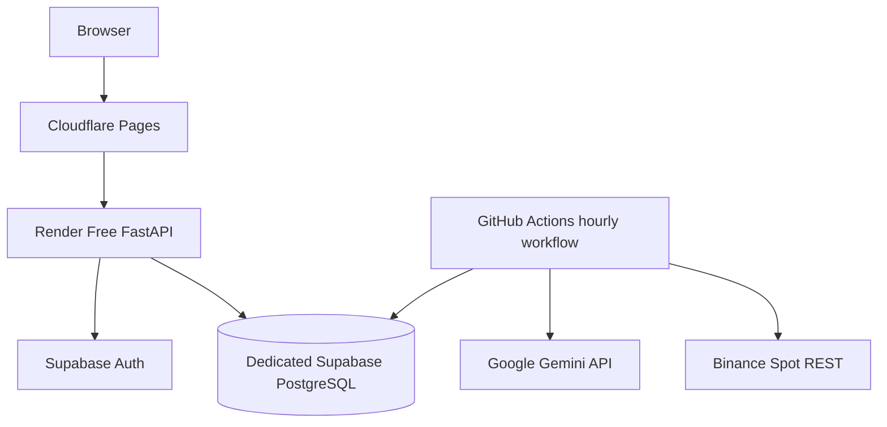

# The Daily Roast AI

> **Evidence-Driven Market Intelligence**

The Daily Roast AI is a documentation-first market research, backtesting, paper-trading, and Gemini-assisted decision-support platform.

The product helps users inspect evidence, compare deterministic and AI-assisted analysis, test strategies, simulate decisions, and understand risk before real capital is considered. The first implementation focuses on cryptocurrency markets, but the product model is designed to expand later to equities, ETFs, foreign exchange, commodities, and macro research.

> **Current status:** implementation specification. Source directories remain placeholders until their corresponding tasks are implemented and verified.

## Product Identity

- **Official brand:** The Daily Roast AI
- **Official tagline:** Evidence-Driven Market Intelligence
- **Primary domain:** `thedailyroast.online`
- **Application:** `app.thedailyroast.online`
- **API:** `api.thedailyroast.online`
- **Documentation:** `docs.thedailyroast.online`
- **Status:** `status.thedailyroast.online`

The repository name `Ai-trade-bot` is a technical legacy identifier. User-facing interfaces, documentation headings, reports, notifications, and marketing content MUST use **The Daily Roast AI**.

## Product Promise

The Daily Roast AI does not promise profit or certainty. It promises transparent evidence, explicit uncertainty, deterministic risk controls, reproducible research, and complete decision lineage.

## Development Lifecycle

```text
Local development
  -> automated CI and security checks
  -> free cloud demo
  -> controlled 30-day paper experiment
  -> staging
  -> production-grade research service
  -> separately approved Binance sandbox assessment
  -> separately approved live-trading assessment
```

Production development means production-quality research software. It does not automatically authorize private exchange access or real-money trading.

## MVP Scope

Included:

- finalized Binance Spot OHLCV through REST polling;
- data-quality validation, gap repair, immutable snapshots, and versioned features;
- Google Gemini advisory analysis with schema and evidence validation;
- deterministic strategy and non-bypassable risk controls;
- paper orders, fills, fees, spread, slippage, precision, and reconciliation;
- append-only double-entry portfolio ledger;
- reproducible backtesting and cash/buy-and-hold benchmarks;
- reproducible local development and layered automated tests;
- a public cloud frontend and API;
- an approximately hourly cloud research cycle;
- a controlled 30-day virtual EUR 20 experiment.

Excluded from the MVP:

- live trading and private Binance order placement;
- leverage, margin, futures, options, shorting, custody, and withdrawals;
- high-frequency trading, market making, and arbitrage;
- autonomous AI execution authority;
- guaranteed profitability;
- production SLA or high availability;
- public multi-tenant SaaS and billing.

## Free Cloud Deployment



| Component | Selected service |
|---|---|
| Frontend | Cloudflare Pages Free |
| Backend API | Render Free Web Service |
| Database and Auth | Dedicated Supabase Free project |
| Scheduled execution | GitHub Actions |
| AI | Gemini API free allowance with EUR 0 budget default |
| Market data | Binance Spot public REST |

Free tiers are best-effort. They may sleep, pause, throttle, restart, delay scheduled work, or change limits. The system must degrade safely and does not claim production availability.

The unrelated Eventnexus Supabase project MUST NOT be reused. The Daily Roast AI requires a dedicated project, schema, credentials, Auth users, RLS policies, and migrations.

## Core Safety Flow

```text
GitHub Actions cycle
  -> Binance finalized REST candles
  -> validation and immutable snapshot
  -> deterministic features
  -> optional Gemini structured analysis
  -> deterministic strategy intent
  -> deterministic risk evaluation
  -> paper execution
  -> append-only ledger
  -> reconciliation and audit
```

Gemini cannot create orders, size final positions, select credentials, mutate the database, alter risk policy, or enable live trading.

## Initial Experiment

- Virtual initial balance: EUR 20
- Primary pair: BTC/EUR
- Candle and cycle interval: approximately one hour
- Maximum position: 25% of reconciled equity
- Maximum order: EUR 5 equivalent
- Maximum daily drawdown: 5%
- Maximum total drawdown: 15%
- Maximum open orders: one
- No leverage or shorting
- Gemini monthly cost budget: EUR 0 by default
- Benchmarks: cash and buy-and-hold
- Duration: 30 calendar days

Profit is not an acceptance criterion. The experiment measures correctness, safety, data completeness, decision lineage, accounting integrity, cloud reliability, and AI handling.

## Authoritative Technology Stack

- Python 3.12
- FastAPI, Pydantic v2, SQLAlchemy 2, Alembic
- Supabase-managed PostgreSQL and Supabase Auth
- Polars
- Binance Spot REST
- Google Gemini API with the official `google-genai` SDK
- React, TypeScript, Vite, and TanStack Query
- Cloudflare Pages, Render, and GitHub Actions
- Supabase CLI for local database and Auth development
- Pytest, Hypothesis, Ruff, MyPy, Bandit, Semgrep, and Trivy

## Documentation Precedence

1. Security, financial-integrity, privacy, and fail-closed requirements
2. [`AGENTS.md`](AGENTS.md)
3. [`docs/PRODUCT_REQUIREMENTS.md`](docs/PRODUCT_REQUIREMENTS.md)
4. [`docs/PRODUCT_VISION.md`](docs/PRODUCT_VISION.md), architecture documents, and accepted ADRs
5. Brand and design foundation documents
6. Domain specifications
7. The selected detailed task file
8. Existing implementation conventions

## Brand and Product Foundation

| File | Responsibility |
|---|---|
| [`docs/BRAND_GUIDELINES.md`](docs/BRAND_GUIDELINES.md) | Brand identity, positioning, voice, visual direction, and domain strategy |
| [`docs/PRODUCT_VISION.md`](docs/PRODUCT_VISION.md) | Long-term product vision, market position, product pillars, and evolution |
| [`docs/MISSION_AND_VALUES.md`](docs/MISSION_AND_VALUES.md) | Mission, values, behavioral commitments, and decision tests |
| [`docs/DESIGN_PRINCIPLES.md`](docs/DESIGN_PRINCIPLES.md) | Product, UX, interface, accessibility, and trust design principles |
| [`docs/NAMING_CONVENTIONS.md`](docs/NAMING_CONVENTIONS.md) | Product, code, API, database, environment, event, and documentation naming rules |
| [`docs/BRAND_FOUNDATION_AUDIT.md`](docs/BRAND_FOUNDATION_AUDIT.md) | Sprint 1 consistency audit and remaining migration work |

## Engineering and Product Documentation

| File | Responsibility |
|---|---|
| [`AGENTS.md`](AGENTS.md) | Mandatory coding-agent and contributor rules |
| [`TASKS.md`](TASKS.md) | Shared domain and implementation backlog |
| [`CLOUD_MVP_TASKS.md`](CLOUD_MVP_TASKS.md) | Detailed free-cloud deployment tasks |
| [`LOCAL_AND_PRODUCTION_TASKS.md`](LOCAL_AND_PRODUCTION_TASKS.md) | Local, testing, staging, production research, and post-launch tasks |
| [`ROADMAP.md`](ROADMAP.md) | Gated product and engineering evolution |
| [`docs/PRODUCT_REQUIREMENTS.md`](docs/PRODUCT_REQUIREMENTS.md) | Product and experiment requirements |
| [`docs/ARCHITECTURE.md`](docs/ARCHITECTURE.md) | Runtime and domain architecture |
| [`docs/FREE_CLOUD_ARCHITECTURE.md`](docs/FREE_CLOUD_ARCHITECTURE.md) | Zero-cost cloud topology and limitations |
| [`docs/LOCAL_DEVELOPMENT.md`](docs/LOCAL_DEVELOPMENT.md) | Local tools, profiles, commands, seed data, and completion gates |
| [`docs/TEST_ENVIRONMENTS.md`](docs/TEST_ENVIRONMENTS.md) | Environment matrix and validation gates |
| [`docs/PRODUCTION_DEVELOPMENT.md`](docs/PRODUCTION_DEVELOPMENT.md) | Post-MVP production research development |
| [`docs/API_SPECIFICATION.md`](docs/API_SPECIFICATION.md) | FastAPI resources, commands, errors, and OpenAPI rules |
| [`docs/DATABASE_SCHEMA.md`](docs/DATABASE_SCHEMA.md) | PostgreSQL entities, constraints, ledger, and retention |
| [`docs/AI_ARCHITECTURE.md`](docs/AI_ARCHITECTURE.md) | AI provider boundary and validation |
| [`docs/GEMINI_INTEGRATION.md`](docs/GEMINI_INTEGRATION.md) | Gemini SDK, budgets, structured output, retries, and safety |
| [`docs/SECURITY.md`](docs/SECURITY.md) | Threats, secrets, Auth, RLS, and release gates |
| [`docs/TESTING.md`](docs/TESTING.md) | Domain test policy and quality gates |
| [`docs/DOCUMENTATION_AUDIT.md`](docs/DOCUMENTATION_AUDIT.md) | Latest whole-repository documentation audit |

## Implementation Entry Point

1. Start with `T1.1` and `T1.2` in `TASKS.md`.
2. Complete local foundation tasks `L1.1-L1.4`.
3. Follow `C1-C8` in `CLOUD_MVP_TASKS.md` with their domain dependencies.
4. Complete `L2` test and recovery gates before the formal experiment.
5. After the demo and experiment, use `P1` tasks for staging and production research development.

## Engineering Principles

- evidence over hype;
- research before execution;
- deterministic controls around probabilistic AI;
- PostgreSQL and the append-only ledger as sources of truth;
- decimal monetary arithmetic and UTC timestamps;
- idempotent side effects;
- deny-by-default browser access;
- no secrets in source, frontend bundles, logs, metrics, or prompts;
- safe degradation when free services are unavailable;
- identical core contracts across local, demo, staging, and production research;
- no profitability or uptime guarantees.

## Disclaimer

The Daily Roast AI is a research and engineering project. It does not provide financial advice and does not guarantee profitability. Cryptocurrency and other financial markets are volatile and may cause complete loss of capital.
