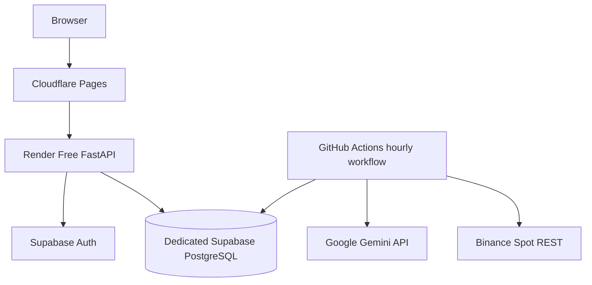

# AI Trade Bot

AI Trade Bot is a documentation-first cryptocurrency research, backtesting, paper-trading, and Gemini-assisted decision-support platform.

The first cloud MVP uses Binance Spot public REST data, deterministic indicators, Google Gemini structured analysis, deterministic strategy and risk rules, and simulated paper execution. It is designed to run while the owner's local computer is off and to require no mandatory monthly infrastructure payment during the initial experiment.

> **Current status:** implementation specification. Source directories remain placeholders until their tasks are implemented and verified.

## Development Lifecycle

```text
Local development
  -> automated CI and security checks
  -> free cloud demo
  -> controlled 30-day paper experiment
  -> staging
  -> production-grade research service
  -> separately approved Binance sandbox assessment
  -> separately approved live-trading assessment
```

Production development means production-quality research software. It does not automatically authorize private Binance access or real-money trading.

## MVP Scope

Included:

- finalized Binance Spot OHLCV through REST polling;
- data-quality validation, gap repair, immutable snapshots, and versioned features;
- Google Gemini advisory analysis with schema and evidence validation;
- deterministic strategy and non-bypassable deterministic risk controls;
- paper orders, fills, fees, spread, slippage, precision, and reconciliation;
- append-only double-entry portfolio ledger;
- reproducible backtesting and cash/buy-and-hold benchmarks;
- reproducible local development and layered automated tests;
- a public cloud frontend and API;
- an approximately hourly cloud research cycle;
- a controlled 30-day virtual EUR 20 experiment.

Excluded from the MVP:

- live trading and private Binance order placement;
- leverage, margin, futures, options, shorting, custody, and withdrawals;
- high-frequency trading, market making, and arbitrage;
- autonomous AI execution authority;
- guaranteed profitability;
- production SLA or high availability.

## Free Cloud Deployment



| Component | Selected service |
|---|---|
| Frontend | Cloudflare Pages Free |
| Backend API | Render Free Web Service |
| Database and Auth | Dedicated Supabase Free project |
| Scheduled execution | GitHub Actions |
| AI | Gemini API free allowance with EUR 0 budget default |
| Market data | Binance Spot public REST |

Free tiers are best-effort. They may sleep, pause, throttle, restart, delay scheduled work, or change limits. The system must degrade safely and does not claim production availability.

The existing Eventnexus Supabase project must not be reused. AI Trade Bot requires a separate project, schema, credentials, Auth users, RLS policies, and migrations.

## Local Development

The normal local profile uses:

- Python 3.12 and locked backend dependencies;
- Node.js LTS and locked frontend dependencies;
- Supabase CLI for local PostgreSQL, Auth, migrations, RLS, and seed data;
- fake Binance and fake Gemini providers by default;
- a one-shot research-cycle CLI;
- deterministic fixtures and failure injection;
- cross-platform commands for Windows 11 and Unix-like systems.

A real Gemini development key and Binance public REST are optional, explicitly enabled, and never required for normal tests.

See [`docs/LOCAL_DEVELOPMENT.md`](docs/LOCAL_DEVELOPMENT.md).

## Testing and Validation

Testing progresses through unit, property, integration, contract, local E2E, cloud demo, formal paper experiment, staging, and future production validation.

Normal CI:

- does not call paid Gemini APIs;
- does not use production Supabase;
- does not use private Binance credentials;
- applies migrations from a clean database;
- tests RLS and authorization;
- validates financial invariants and idempotency;
- checks frontend bundles for accidental secrets;
- verifies documentation and generated artifacts.

See [`docs/TEST_ENVIRONMENTS.md`](docs/TEST_ENVIRONMENTS.md) and [`docs/TESTING.md`](docs/TESTING.md).

## Production Development After the Demo

After the free cloud demo and paper experiment, the next path is a separate staging environment followed by a production-grade **research service**. Production work requires isolated environments, protected CI/CD, managed backups, restore tests, measured SLOs, incident response, stronger authentication, security and privacy review, and explicit cost planning.

The free stack is reviewed rather than assumed to be permanent. Redis/ARQ, persistent workers, WebSocket ingestion, paid database capacity, and managed observability may be introduced only from measured need and accepted ADRs.

See [`docs/PRODUCTION_DEVELOPMENT.md`](docs/PRODUCTION_DEVELOPMENT.md).

## Deliberate MVP Simplification

Redis, ARQ, a persistent Binance WebSocket worker, hosted Prometheus/Grafana, Kubernetes, and private Binance APIs are deferred. The hourly experiment uses a one-shot Python research-cycle CLI scheduled by GitHub Actions and protected by PostgreSQL locking and idempotency.

## Core Safety Flow

```text
GitHub Actions cycle
  -> Binance finalized REST candles
  -> validation and immutable snapshot
  -> deterministic features
  -> optional Gemini structured analysis
  -> deterministic strategy intent
  -> deterministic risk evaluation
  -> paper execution
  -> append-only ledger
  -> reconciliation and audit
```

Gemini cannot create orders, size final positions, select credentials, mutate the database, alter risk policy, or enable live trading.

## Initial Experiment

- Virtual initial balance: EUR 20
- Primary pair: BTC/EUR
- Candle/cycle interval: approximately one hour
- Maximum position: 25% of reconciled equity
- Maximum order: EUR 5 equivalent
- Maximum daily drawdown: 5%
- Maximum total drawdown: 15%
- Maximum open orders: one
- No leverage or shorting
- Gemini monthly cost budget: EUR 0 by default
- Benchmarks: cash and buy-and-hold
- Duration: 30 calendar days

Profit is not an acceptance criterion. The experiment measures correctness, safety, data completeness, decision lineage, accounting integrity, cloud reliability, and AI handling.

## Authoritative Technology Stack

- Python 3.12
- FastAPI, Pydantic v2, SQLAlchemy 2, Alembic
- Supabase-managed PostgreSQL and Supabase Auth
- Polars
- Binance Spot REST
- Google Gemini API with the official `google-genai` SDK
- React, TypeScript, Vite, TanStack Query
- Cloudflare Pages, Render, and GitHub Actions
- Supabase CLI for local database/Auth development
- Pytest, Hypothesis, Ruff, MyPy, Bandit, Semgrep, Trivy

## Repository Structure

```text
.
├── AGENTS.md
├── README.md
├── TASKS.md
├── CLOUD_MVP_TASKS.md
├── LOCAL_AND_PRODUCTION_TASKS.md
├── ROADMAP.md
├── CONTRIBUTING.md
├── CHANGELOG.md
├── .env.example
├── docs/
├── backend/
├── frontend/
├── ai/
├── infrastructure/
├── supabase/
└── tests/
```

## Documentation Precedence

1. Security, financial-integrity, and fail-closed requirements
2. [`AGENTS.md`](AGENTS.md)
3. [`docs/PRODUCT_REQUIREMENTS.md`](docs/PRODUCT_REQUIREMENTS.md)
4. Architecture, accepted ADRs, and environment-specific architecture documents
5. Domain specifications
6. The selected detailed task file
7. Shared implementation conventions

## Documentation Inventory

| File | Responsibility |
|---|---|
| [`AGENTS.md`](AGENTS.md) | Mandatory coding-agent and contributor rules |
| [`TASKS.md`](TASKS.md) | Shared domain and implementation backlog |
| [`CLOUD_MVP_TASKS.md`](CLOUD_MVP_TASKS.md) | Detailed free-cloud deployment task sequence |
| [`LOCAL_AND_PRODUCTION_TASKS.md`](LOCAL_AND_PRODUCTION_TASKS.md) | Local environment, test automation, staging, production research, and post-launch tasks |
| [`docs/FREE_CLOUD_ARCHITECTURE.md`](docs/FREE_CLOUD_ARCHITECTURE.md) | Zero-cost cloud topology, boundaries, limitations, and promotion criteria |
| [`docs/FREE_CLOUD_REQUIREMENTS.md`](docs/FREE_CLOUD_REQUIREMENTS.md) | Free-cloud requirements that refine the main PRD |
| [`docs/LOCAL_DEVELOPMENT.md`](docs/LOCAL_DEVELOPMENT.md) | Local tools, profiles, commands, seed data, debugging, Windows support, and local completion gates |
| [`docs/TEST_ENVIRONMENTS.md`](docs/TEST_ENVIRONMENTS.md) | Environment matrix, fixtures, CI workflows, demo, paper, staging, and production validation gates |
| [`docs/PRODUCTION_DEVELOPMENT.md`](docs/PRODUCTION_DEVELOPMENT.md) | Post-MVP staging, production research service, CI/CD, security, recovery, SLO, cost, and launch requirements |
| [`docs/PRODUCT_REQUIREMENTS.md`](docs/PRODUCT_REQUIREMENTS.md) | Product and experiment requirements |
| [`docs/ARCHITECTURE.md`](docs/ARCHITECTURE.md) | Runtime and domain architecture |
| [`docs/DEPLOYMENT.md`](docs/DEPLOYMENT.md) | Deployment, secrets, migrations, backup, and failure procedures |
| [`docs/TECH_STACK.md`](docs/TECH_STACK.md) | Selected technologies and deferred infrastructure |
| [`docs/DATABASE_SCHEMA.md`](docs/DATABASE_SCHEMA.md) | PostgreSQL entities, constraints, ledger, and retention |
| [`docs/API_SPECIFICATION.md`](docs/API_SPECIFICATION.md) | FastAPI resources, commands, errors, and OpenAPI rules |
| [`docs/AI_ARCHITECTURE.md`](docs/AI_ARCHITECTURE.md) | AI provider boundary and validation |
| [`docs/GEMINI_INTEGRATION.md`](docs/GEMINI_INTEGRATION.md) | Gemini SDK, budgets, structured output, retries, and safety |
| [`docs/MARKET_DATA.md`](docs/MARKET_DATA.md) | Binance data rules and quality |
| [`docs/STRATEGY_ENGINE.md`](docs/STRATEGY_ENGINE.md) | Deterministic strategy contracts |
| [`docs/RISK_ENGINE.md`](docs/RISK_ENGINE.md) | Risk limits and halts |
| [`docs/PAPER_TRADING.md`](docs/PAPER_TRADING.md) | Simulated execution model |
| [`docs/PORTFOLIO_ENGINE.md`](docs/PORTFOLIO_ENGINE.md) | Ledger, balances, P&L, and reconciliation |
| [`docs/BACKTEST_ENGINE.md`](docs/BACKTEST_ENGINE.md) | Reproducible historical replay |
| [`docs/SECURITY.md`](docs/SECURITY.md) | Threats, secrets, Auth, RLS, and release gates |
| [`docs/TESTING.md`](docs/TESTING.md) | Domain test policy and quality gates |
| [`docs/OBSERVABILITY.md`](docs/OBSERVABILITY.md) | Logs, cycle status, alerts, and future production signals |
| [`docs/DOCUMENTATION_AUDIT.md`](docs/DOCUMENTATION_AUDIT.md) | Latest documentation audit |

## Implementation Entry Point

1. Start with `T1.1` and `T1.2` in `TASKS.md`.
2. Complete local foundation tasks `L1.1-L1.4`.
3. Follow `C1-C8` in `CLOUD_MVP_TASKS.md` with their domain dependencies.
4. Complete `L2` test and recovery gates before the formal experiment.
5. After the demo and experiment, use `P1` tasks for staging and production research development.

## Engineering Principles

- deterministic controls around probabilistic AI;
- PostgreSQL and append-only ledger as sources of truth;
- decimal monetary arithmetic and UTC timestamps;
- idempotent side effects;
- deny-by-default browser access;
- no secrets in source, frontend bundles, logs, metrics, or prompts;
- safe degradation when free services are unavailable;
- identical core contracts across local, demo, staging, and production research;
- no profitability or uptime guarantees.

## Disclaimer

This project is for research and engineering experimentation. It does not provide financial advice and does not guarantee profitability. Cryptocurrency markets are volatile and may cause complete loss of capital.
