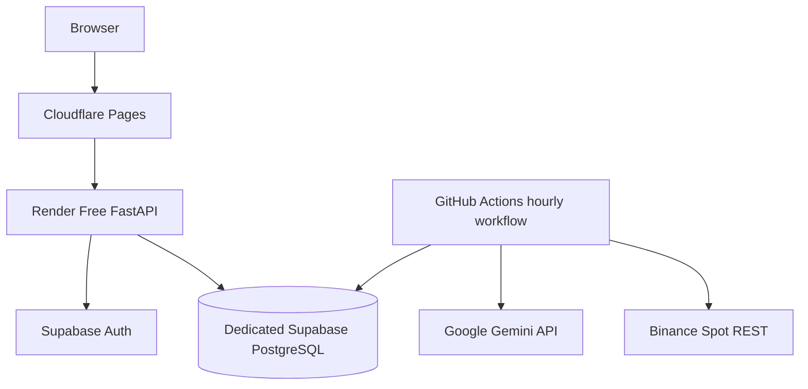

# AI Trade Bot

AI Trade Bot is a documentation-first cryptocurrency research, backtesting, paper-trading, and AI decision-support platform.

The first cloud MVP uses Binance Spot public REST data, deterministic indicators, Google Gemini structured analysis, deterministic strategy and risk rules, and simulated paper execution. It is designed to run while the owner's local computer is off and to require no mandatory monthly infrastructure payment during the initial experiment.

> **Current status:** implementation specification. Source directories remain placeholders until their tasks are implemented and verified.

## MVP Scope

Included:

- finalized Binance Spot OHLCV through REST polling;
- data-quality validation, gap repair, immutable snapshots, and versioned features;
- Google Gemini advisory analysis with schema and evidence validation;
- deterministic strategy and non-bypassable risk controls;
- paper orders, fills, fees, spread, slippage, precision, and reconciliation;
- append-only double-entry portfolio ledger;
- reproducible backtesting and cash/buy-and-hold benchmarks;
- a public cloud frontend and API;
- an approximately hourly cloud research cycle;
- a controlled 30-day virtual EUR 20 experiment.

Excluded from the MVP:

- live trading and private Binance order placement;
- leverage, margin, futures, options, shorting, custody, and withdrawals;
- high-frequency trading, market making, and arbitrage;
- autonomous AI execution authority;
- guaranteed profitability;
- production SLA or high availability.

## Free Cloud Deployment



| Component | Selected service |
|---|---|
| Frontend | Cloudflare Pages Free |
| Backend API | Render Free Web Service |
| Database and Auth | Dedicated Supabase Free project |
| Scheduled execution | GitHub Actions |
| AI | Gemini API free allowance with EUR 0 budget default |
| Market data | Binance Spot public REST |

Free tiers are best-effort. They may sleep, pause, throttle, restart, delay scheduled work, or change limits. The system must degrade safely and does not claim production availability.

The existing Eventnexus Supabase project must not be reused. AI Trade Bot requires a separate project, schema, credentials, Auth users, RLS policies, and migrations.

See:

- [`docs/FREE_CLOUD_ARCHITECTURE.md`](docs/FREE_CLOUD_ARCHITECTURE.md)
- [`CLOUD_MVP_TASKS.md`](CLOUD_MVP_TASKS.md)
- [`docs/DEPLOYMENT.md`](docs/DEPLOYMENT.md)

## Deliberate MVP Simplification

Redis, ARQ, a persistent Binance WebSocket worker, hosted Prometheus/Grafana, Kubernetes, and private Binance APIs are deferred. The hourly experiment uses a one-shot Python research-cycle CLI scheduled by GitHub Actions and protected by PostgreSQL locking and idempotency.

## Core Safety Flow

```text
GitHub Actions cycle
  -> Binance finalized REST candles
  -> validation and immutable snapshot
  -> deterministic features
  -> optional Gemini structured analysis
  -> deterministic strategy intent
  -> deterministic risk evaluation
  -> paper execution
  -> append-only ledger
  -> reconciliation and audit
```

Gemini cannot create orders, size final positions, select credentials, mutate the database, alter risk policy, or enable live trading.

## Initial Experiment

- Virtual initial balance: EUR 20
- Primary pair: BTC/EUR
- Candle/cycle interval: approximately one hour
- Maximum position: 25% of reconciled equity
- Maximum order: EUR 5 equivalent
- Maximum daily drawdown: 5%
- Maximum total drawdown: 15%
- Maximum open orders: one
- No leverage or shorting
- Gemini monthly cost budget: EUR 0 by default
- Benchmarks: cash and buy-and-hold
- Duration: 30 calendar days

Profit is not an acceptance criterion. The experiment measures correctness, safety, data completeness, decision lineage, accounting integrity, cloud reliability, and AI handling.

## Authoritative Technology Stack

- Python 3.12
- FastAPI, Pydantic v2, SQLAlchemy 2, Alembic
- Supabase-managed PostgreSQL and Supabase Auth
- Polars
- Binance Spot REST
- Google Gemini API with the official `google-genai` SDK
- React, TypeScript, Vite, TanStack Query
- Cloudflare Pages, Render, and GitHub Actions
- Pytest, Hypothesis, Ruff, MyPy, Bandit, Semgrep, Trivy

## Repository Structure

```text
.
├── AGENTS.md
├── README.md
├── TASKS.md
├── CLOUD_MVP_TASKS.md
├── ROADMAP.md
├── CONTRIBUTING.md
├── CHANGELOG.md
├── .env.example
├── docs/
├── backend/
├── frontend/
├── ai/
├── infrastructure/
├── supabase/
└── tests/
```

## Documentation Precedence

1. Security, financial-integrity, and fail-closed requirements
2. [`AGENTS.md`](AGENTS.md)
3. [`docs/PRODUCT_REQUIREMENTS.md`](docs/PRODUCT_REQUIREMENTS.md)
4. Architecture, accepted ADRs, and [`docs/FREE_CLOUD_ARCHITECTURE.md`](docs/FREE_CLOUD_ARCHITECTURE.md)
5. Domain specifications
6. [`CLOUD_MVP_TASKS.md`](CLOUD_MVP_TASKS.md) for free-cloud deployment work
7. [`TASKS.md`](TASKS.md) for shared domain implementation

## Documentation Inventory

| File | Responsibility |
|---|---|
| [`AGENTS.md`](AGENTS.md) | Mandatory coding-agent and contributor rules |
| [`TASKS.md`](TASKS.md) | Shared domain and implementation backlog |
| [`CLOUD_MVP_TASKS.md`](CLOUD_MVP_TASKS.md) | Detailed free-cloud deployment task sequence |
| [`docs/FREE_CLOUD_ARCHITECTURE.md`](docs/FREE_CLOUD_ARCHITECTURE.md) | Zero-cost cloud topology, boundaries, limitations, and promotion criteria |
| [`docs/PRODUCT_REQUIREMENTS.md`](docs/PRODUCT_REQUIREMENTS.md) | Product and experiment requirements |
| [`docs/ARCHITECTURE.md`](docs/ARCHITECTURE.md) | Runtime and domain architecture |
| [`docs/DEPLOYMENT.md`](docs/DEPLOYMENT.md) | Deployment, secrets, migrations, backup, and failure procedures |
| [`docs/TECH_STACK.md`](docs/TECH_STACK.md) | Selected technologies and deferred infrastructure |
| [`docs/DATABASE_SCHEMA.md`](docs/DATABASE_SCHEMA.md) | PostgreSQL entities, constraints, ledger, and retention |
| [`docs/API_SPECIFICATION.md`](docs/API_SPECIFICATION.md) | FastAPI resources, commands, errors, and OpenAPI rules |
| [`docs/AI_ARCHITECTURE.md`](docs/AI_ARCHITECTURE.md) | AI provider boundary and validation |
| [`docs/GEMINI_INTEGRATION.md`](docs/GEMINI_INTEGRATION.md) | Gemini SDK, budgets, structured output, retries, and safety |
| [`docs/MARKET_DATA.md`](docs/MARKET_DATA.md) | Binance data rules and quality |
| [`docs/STRATEGY_ENGINE.md`](docs/STRATEGY_ENGINE.md) | Deterministic strategy contracts |
| [`docs/RISK_ENGINE.md`](docs/RISK_ENGINE.md) | Risk limits and halts |
| [`docs/PAPER_TRADING.md`](docs/PAPER_TRADING.md) | Simulated execution model |
| [`docs/PORTFOLIO_ENGINE.md`](docs/PORTFOLIO_ENGINE.md) | Ledger, balances, P&L, and reconciliation |
| [`docs/BACKTEST_ENGINE.md`](docs/BACKTEST_ENGINE.md) | Reproducible historical replay |
| [`docs/SECURITY.md`](docs/SECURITY.md) | Threats, secrets, Auth, RLS, and release gates |
| [`docs/TESTING.md`](docs/TESTING.md) | Test policy and quality gates |
| [`docs/OBSERVABILITY.md`](docs/OBSERVABILITY.md) | Logs, cycle status, alerts, and future metrics |
| [`docs/DOCUMENTATION_AUDIT.md`](docs/DOCUMENTATION_AUDIT.md) | Latest documentation audit |

## Implementation Entry Point

Start with `T1.1` and `T1.2` in `TASKS.md`, then follow `C1` through `C8` in `CLOUD_MVP_TASKS.md` together with their domain dependencies.

## Engineering Principles

- deterministic controls around probabilistic AI;
- PostgreSQL and append-only ledger as sources of truth;
- decimal monetary arithmetic and UTC timestamps;
- idempotent side effects;
- deny-by-default browser access;
- no secrets in source, frontend bundles, logs, metrics, or prompts;
- safe degradation when free services are unavailable;
- no profitability or uptime guarantees.

## Disclaimer

This project is for research and engineering experimentation. It does not provide financial advice and does not guarantee profitability. Cryptocurrency markets are volatile and may cause complete loss of capital.
