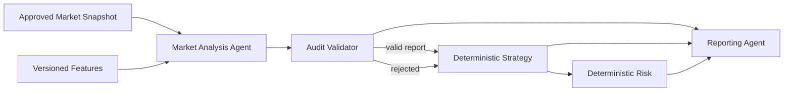

# Runtime AI Agents

Last reviewed: 2026-07-31
Status: Authoritative runtime-agent specification

## 1. Purpose

This document describes AI-assisted analytical components that may exist inside the product. It does not contain instructions for coding agents; those are defined in the root `/AGENTS.md`.

Runtime agents are bounded typed services. They are not autonomous employees, unrestricted tool users, or independent trading authorities.

## 2. MVP Agent Model

The MVP should begin with the smallest useful set of agents:

1. Market Analysis Agent
2. Audit Validator
3. Reporting Agent

Additional specialized agents remain deferred until evidence shows they improve accuracy or explainability enough to justify added cost and complexity.

Google Gemini API is the required cloud model provider for version 1. A deterministic fake provider is used in tests.

## 3. Universal Agent Contract

Every runtime agent defines:

- immutable agent version;
- purpose and non-purpose;
- allowed input schema;
- required output schema;
- prompt version;
- report schema version;
- configured Gemini model identifier;
- timeout;
- retry policy;
- token and cost budget;
- safety settings;
- validation rules;
- fallback behavior;
- audit fields;
- evaluation dataset and metrics.

Every invocation references an immutable market snapshot and deterministic feature-set version.

## 4. Universal Safety Rules

Runtime agents must not:

- create, update, cancel, or submit orders;
- access exchange credentials;
- choose or modify position size;
- modify strategy or risk policy;
- enable live trading;
- mutate the database directly;
- execute shell commands or arbitrary code;
- use web search or external tools in the MVP;
- read secrets or authentication tokens;
- treat untrusted text as instructions;
- silently change prompt, schema, model, or safety versions.

Malformed, stale, unsupported, refused, safety-blocked, or ungrounded output is rejected.

## 5. Market Analysis Agent

### Purpose

Classify the current market regime and summarize structured evidence from approved deterministic features.

### Inputs

- market snapshot ID;
- exchange and normalized symbol;
- interval and analysis time;
- finalized candle range metadata;
- feature-set version;
- typed trend, momentum, volatility, and volume features;
- data quality and freshness status;
- prompt and schema versions.

### Outputs

- market regime: bullish, bearish, sideways, or uncertain;
- advisory action: hold, enter, exit, or reduce;
- analytical confidence;
- evidence references;
- contradictions;
- risks;
- missing information;
- invalidation conditions;
- concise summary.

### Non-Purpose

The agent does not calculate position size, create an order, predict guaranteed return, or override strategy and risk.

### Fallback

Invalid or unavailable output becomes a rejected analysis. Downstream behavior is deterministic fallback or HOLD according to policy.

## 6. Audit Validator

### Purpose

Validate a stored AI report and its lineage.

This component should be deterministic wherever possible. Gemini may assist only in optional semantic unsupported-claim review; structural and reference validation remains deterministic.

### Checks

- exact JSON Schema version;
- required and unknown fields;
- enum and range validity;
- evidence references exist in the supplied feature set;
- source snapshot is fresh and approved;
- no unsupported asset, interval, or metric is introduced;
- no instruction attempts to modify risk, strategy, or execution;
- prompt, model, provider, and configuration lineage is complete;
- usage and cost metadata is present;
- report confidence is not presented as probability of profit.

### Output

- valid or rejected;
- machine-readable reason codes;
- warnings;
- validator version;
- evidence validation results.

## 7. Reporting Agent

### Purpose

Transform already validated structured results into a readable experiment or analysis summary.

### Inputs

- validated market analyses;
- strategy and risk decisions;
- paper-trading and portfolio metrics;
- benchmark results;
- incidents, halts, and data-quality events.

### Restrictions

- must not invent events or metrics;
- every material statement must be traceable to structured input;
- must distinguish paper trading from real trading;
- must state that confidence is not probability of profit;
- must not provide personalized financial advice;
- generated narrative is not the accounting source of truth.

### Output

A structured report plus optional human-readable narrative. The structured report is validated and versioned.

## 8. Deferred Specialized Agents

The following are not required for MVP:

### Technical Specialist

Could provide deeper trend, momentum, volatility, and volume interpretation. It must not duplicate deterministic indicator calculations.

### News Analyst

Requires a separately approved news-ingestion pipeline, source provenance, licensing review, prompt-injection controls, freshness rules, and evaluation dataset.

### Social Sentiment Analyst

Requires source terms review, bot/spam handling, data minimization, provenance, and strong prompt-injection testing.

### On-Chain or Whale Analyst

Requires a reliable data provider, chain-specific normalization, source validation, and separate domain specification.

### Strategy Reviewer

May record agreement or disagreement with deterministic strategy, but cannot change the intent or approve execution.

### Risk Explanation Agent

May explain a deterministic risk result, but cannot produce the authoritative decision.

### Supervisor or Multi-Agent Aggregator

Requires an ADR, measurable benefit, bounded voting/aggregation rules, conflict handling, additional budgets, and evaluation against a simpler single-agent baseline.

## 9. Orchestration

The application service controls orchestration.

A rejected AI report may still be recorded and reported, but cannot be treated as valid strategy evidence.

## 10. Agent Versioning

An agent version changes when any of these change materially:

- system instruction;
- prompt template;
- report schema;
- Gemini model identifier;
- safety settings;
- generation settings;
- input feature contract;
- validation policy;
- fallback policy.

Active experiments continue using their frozen versions.

## 11. Evaluation

Each agent requires a versioned evaluation set.

Minimum metrics:

- schema-valid rate;
- evidence-grounding rate;
- unsupported-claim rate;
- action consistency;
- false certainty rate;
- prompt-injection resistance;
- safety-block and refusal handling;
- latency;
- token usage;
- estimated cost;
- stability across repeated runs.

A more complex agent design must outperform the simpler baseline on predefined metrics before adoption.

## 12. Audit Fields

Every invocation stores:

- agent version;
- provider and configured model;
- prompt and schema versions;
- input snapshot and feature references;
- correlation and request IDs;
- start/end time and latency;
- retry count;
- usage and cost estimate;
- provider status;
- safety/refusal status;
- raw-response retention reference;
- validation outcome;
- fallback outcome.

## 13. Failure Behavior

| Failure | Behavior |
|---|---|
| Stale or invalid source data | do not invoke or reject result |
| Gemini authentication failure | terminal failure, alert, safe fallback |
| Gemini 429 or retryable 5xx | bounded retry, then safe fallback |
| Timeout | bounded retry, then safe fallback |
| Safety block or refusal | persist status, reject report |
| Empty or malformed response | reject report |
| Unsupported claim | reject or mark invalid according to policy |
| Budget exhausted | skip invocation and use deterministic path |
| Missing lineage | reject report |

## 14. Related Documents

- `/AGENTS.md`
- `AI_ARCHITECTURE.md`
- `GEMINI_INTEGRATION.md`
- `AI_PROMPTS.md`
- `STRATEGY_ENGINE.md`
- `RISK_ENGINE.md`
- `SECURITY.md`
- `TESTING.md`
