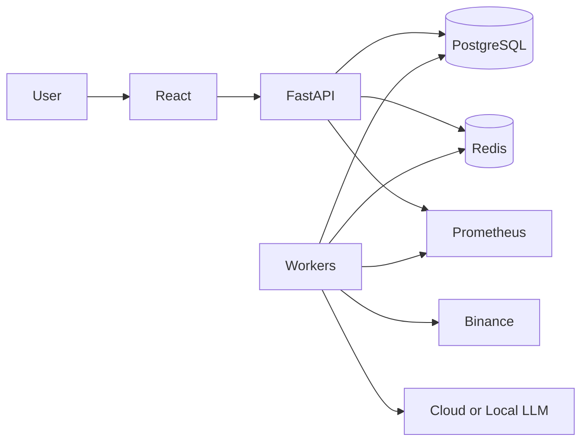

# Architecture

## Style
Modular monolith with background workers.

## Domains
Identity, configuration, market data, features, AI analysis, strategy, risk, execution, portfolio, backtesting, audit, reporting, and operations.

## Components
- API: authentication, validation, commands, read models
- Scheduler: deterministic job creation
- Market worker: fetch, normalize, validate, persist
- Feature engine: versioned deterministic features
- AI worker: bounded prompts and schema validation
- Strategy engine: typed intents without side effects
- Risk engine: approve, resize, reject, or halt
- Paper engine: simulated orders and fills
- Portfolio ledger: append-only accounting
- Backtest engine: historical replay

## Failure Policy
Stale data blocks decisions. Invalid AI output is rejected. Database failure stops side effects. Portfolio mismatch activates global halt. Risk exceptions fail closed.
