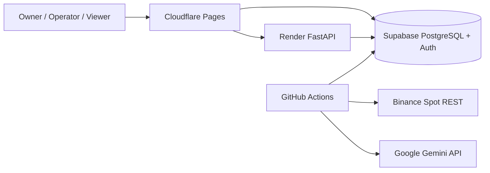
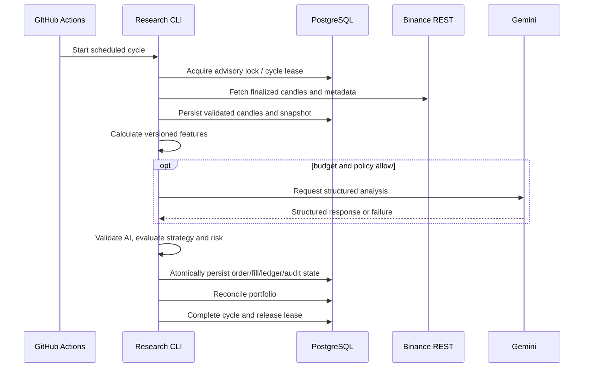

# Architecture

Last reviewed: 2026-07-31
Status: Authoritative free-cloud MVP architecture

## 1. Goals

The architecture separates probabilistic Gemini analysis from deterministic strategy, risk, execution, and accounting. It supports a cloud-hosted 30-day paper experiment without requiring a continuously running local computer or paid infrastructure.

## 2. Architectural Style

The codebase remains a modular monolith. Runtime execution is split into:

- a stateless FastAPI web process;
- a one-shot research-cycle CLI;
- a static React frontend;
- managed PostgreSQL/Auth.

The first cloud profile deliberately avoids a persistent worker queue. The CLI and API share the same application and domain services.

## 3. System Context



Direct frontend access to Supabase is limited to authentication and approved RLS-protected read views. Financial commands pass through FastAPI.

## 4. Application Boundaries

```text
backend/app/
├── api/
├── cli/
├── core/
├── domains/
│   ├── identity/
│   ├── configuration/
│   ├── market_data/
│   ├── features/
│   ├── ai_analysis/
│   ├── strategy/
│   ├── risk/
│   ├── execution/
│   ├── portfolio/
│   ├── backtesting/
│   ├── audit/
│   └── reporting/
└── infrastructure/
    ├── persistence/supabase_postgres/
    ├── auth/supabase/
    ├── exchange/binance/
    ├── ai/gemini/
    └── observability/
```

Domain code does not depend on FastAPI, Supabase SDK types, SQLAlchemy ORM models, Binance SDK types, or Gemini SDK types.

## 5. Primary Hourly Flow



## 6. Scheduling and Concurrency

GitHub Actions is the external scheduler. A database advisory lock or persistent lease ensures at most one cycle mutates a given experiment for a scheduled occurrence.

The workflow is best-effort and may be delayed. Decision timestamps use actual finalized market data, never the intended cron time as a substitute.

## 7. Market Data

The MVP uses Binance Spot REST for symbol metadata, server time, and finalized candles. The hourly polling profile makes a persistent WebSocket unnecessary.

Every cycle performs continuity checks and bounded gap repair. Missing or stale candles block entries. WebSocket support is a future optimization requiring an ADR.

## 8. Gemini Boundary

Gemini receives only structured, versioned evidence. It has no tools or authority to mutate the database, execute code, access exchange credentials, place orders, size positions, or alter strategy/risk policy.

Gemini failure, safety block, invalid schema, or free-quota exhaustion degrades to the configured deterministic/HOLD behavior.

## 9. Strategy, Risk, Execution, and Accounting

- strategies emit immutable intents;
- the risk engine approves, reduces, rejects, or halts;
- paper execution simulates validated orders;
- every fill posts balanced append-only ledger entries;
- portfolio projections reconcile against the ledger;
- mismatch halts the experiment.

These contracts are independent from the hosting platform.

## 10. Data Ownership

Supabase-managed PostgreSQL is authoritative. Local Render or GitHub runner filesystems are disposable.

| Domain | Authoritative records |
|---|---|
| Identity | Supabase subject mapping and application roles |
| Market Data | symbols, candles, quality events, snapshots |
| AI | prompt/model/schema versions, runs, reports, usage |
| Strategy | versions and intents |
| Risk | policies, evaluations, halts |
| Execution | paper orders and fills |
| Portfolio | append-only ledger and reconciled projections |
| Operations | research cycles, audit events, exports |

## 11. Supabase Access Model

- Auth provides identity.
- RLS is enabled on Data API-visible objects.
- browser writes to financial and control tables are prohibited;
- approved read views may be queried with the publishable key;
- service-role and direct database credentials are server/workflow-only;
- migrations are version-controlled and reproducible.

## 12. FastAPI Boundary

Render hosts FastAPI for reads and explicit commands. It does not own scheduling. Cold start or idle spin-down cannot stop the scheduled research cycle.

FastAPI validates Supabase-issued identity tokens and applies application-level owner/operator/viewer authorization.

## 13. Idempotency

Stable keys cover research-cycle occurrence, candle page, snapshot, feature set, Gemini request, strategy intent, risk result, order, fill, ledger transaction, and report.

Retries return prior results or deterministic conflicts. They never duplicate a financial side effect.

## 14. Failure Policy

| Failure | Behavior |
|---|---|
| delayed GitHub schedule | process actual finalized data and record delay |
| overlapping workflow | second cycle cannot acquire lock |
| Render asleep | frontend shows cold-start state; cycle remains independent |
| database unavailable | no side effect; cycle fails |
| Binance unavailable/stale | block entries |
| Gemini unavailable/quota exhausted | deterministic fallback or HOLD |
| invalid precision/fee model/policy | reject |
| reconciliation mismatch | halt and alert |

## 15. Observability

The free profile uses structured logs plus persistent cycle, audit, freshness, halt, and reconciliation records. GitHub Actions, Render, and Supabase logs are operational sources. Hosted Prometheus/Grafana are deferred.

## 16. Architectural Invariants

1. Gemini never executes trades.
2. Strategies never place orders.
3. Every actionable intent passes deterministic risk.
4. Risk fails closed.
5. PostgreSQL is authoritative.
6. The ledger is the financial source of truth.
7. Money uses decimal arithmetic.
8. Finalized candles and decision inputs are immutable/versioned.
9. Side effects are idempotent.
10. Scheduled execution does not depend on Render or a local computer.
11. Free-tier failure causes safe degradation.
12. Live trading remains disabled.

## 17. Future Evolution

Redis/ARQ, persistent WebSocket ingestion, dedicated workers, Prometheus/Grafana, and paid/high-availability services may be introduced only after measured need and accepted ADRs.

## 18. Related Documents

- `FREE_CLOUD_ARCHITECTURE.md`
- `DEPLOYMENT.md`
- `TECH_STACK.md`
- `PRODUCT_REQUIREMENTS.md`
- `SECURITY.md`
- `../CLOUD_MVP_TASKS.md`
