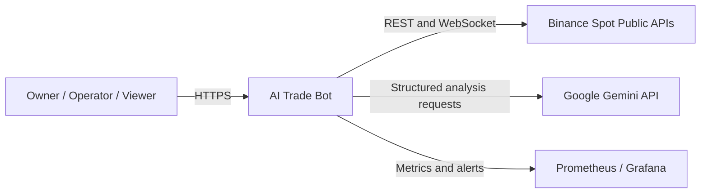
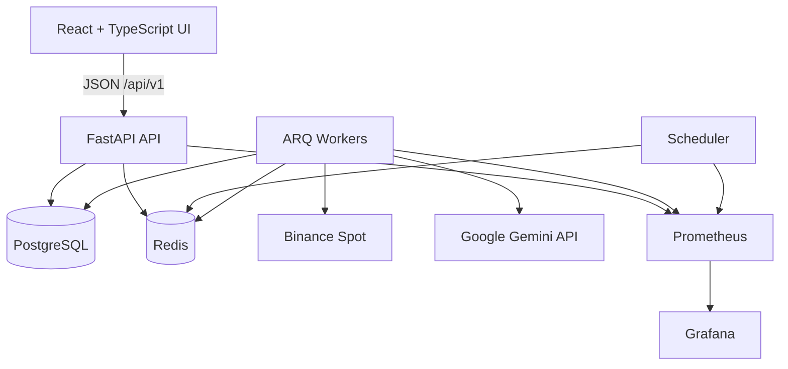
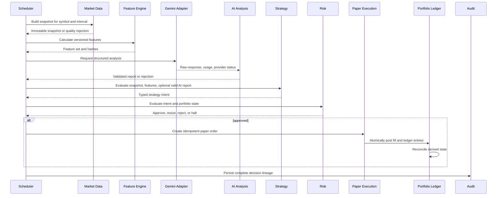
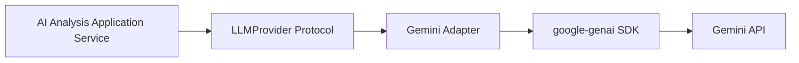
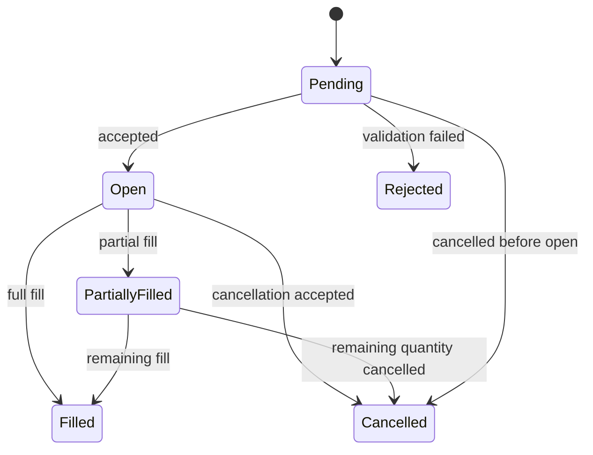
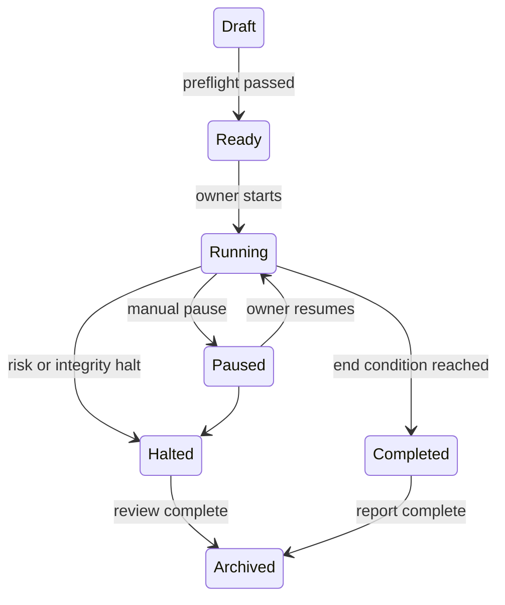
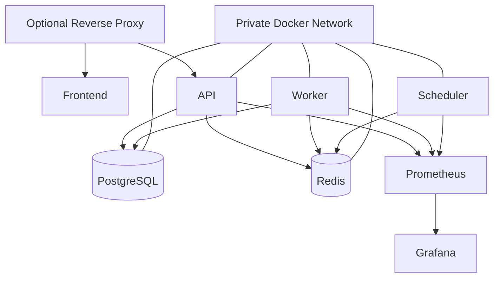

# Architecture

Last reviewed: 2026-07-31
Status: Authoritative MVP architecture

## 1. Architectural Goals

The architecture must keep probabilistic Google Gemini analysis separated from deterministic strategy, risk, execution, and accounting. It must support reproducible research, safe paper trading, complete decision lineage, restart safety, and later progression to a Binance sandbox without requiring a rewrite of the core domains.

## 2. Architectural Style

The MVP uses a modular monolith with independent background workers.

Reasons:

- strong transaction boundaries for portfolio accounting;
- lower deployment and operational complexity than microservices;
- explicit domain boundaries without distributed consistency problems;
- straightforward local development through Docker Compose;
- ability to extract services later if measured load or ownership requires it.

A module boundary is treated as a future service boundary. Cross-domain calls must use application interfaces rather than direct access to another module's tables or internals.

## 3. System Context



## 4. Container View



## 5. Repository and Runtime Boundaries

```text
backend/app/
├── api/                HTTP transport, authentication, request/response models
├── core/               configuration, logging, errors, clocks, IDs
├── domains/
│   ├── identity/
│   ├── configuration/
│   ├── market_data/
│   ├── features/
│   ├── ai_analysis/
│   ├── strategy/
│   ├── risk/
│   ├── execution/
│   ├── portfolio/
│   ├── backtesting/
│   ├── audit/
│   └── reporting/
├── infrastructure/
│   ├── persistence/
│   ├── queue/
│   ├── exchange/binance/
│   ├── ai/gemini/
│   └── observability/
├── workers/
└── main.py
```

Domain code must not depend directly on FastAPI, SQLAlchemy ORM models, Redis clients, Binance SDKs, or Gemini SDK types.

## 6. Domain Responsibilities

### 6.1 Identity

Users, roles, authentication subjects, and authorization policies.

### 6.2 Configuration

Workspace settings, frozen experiment configuration, provider settings, strategy versions, risk-policy versions, and feature flags.

### 6.3 Market Data

Exchange symbols, candles, data quality, freshness, backfill checkpoints, and immutable market snapshots.

### 6.4 Features

Versioned deterministic indicator calculation and feature hashing.

### 6.5 AI Analysis

Project-owned provider protocol, Gemini request construction, structured report validation, evaluation, budgets, and lineage.

### 6.6 Strategy

Deterministic transformation from approved inputs to HOLD, ENTER, EXIT, or REDUCE intents.

### 6.7 Risk

Non-bypassable validation, sizing limits, rejection reasons, and portfolio/workspace halts.

### 6.8 Execution

Paper order state machine, simulated fills, cancellation, fee and slippage models, and idempotency.

### 6.9 Portfolio

Append-only double-entry ledger, positions, balances, P&L, equity, exposure, drawdown, and reconciliation.

### 6.10 Backtesting

Historical replay using the same strategy, risk, execution, and portfolio contracts as paper trading.

### 6.11 Audit and Reporting

Immutable operational and decision events, exports, benchmark comparison, and experiment reports.

## 7. Primary Decision Flow



## 8. Market Data Flow

1. Scheduler creates a deterministic ingestion job key.
2. Binance adapter loads server time and current symbol metadata when required.
3. REST backfill retrieves finalized candles in bounded pages.
4. WebSocket streams provide near-real-time updates.
5. Reconnect triggers gap detection and REST repair.
6. Validation checks chronology, uniqueness, OHLC relationships, volume, interval continuity, and freshness.
7. Finalized valid candles become immutable.
8. Snapshot creation records exact candle identities and quality status.

Strategies and Gemini may not use a snapshot that fails quality or freshness policy.

## 9. Google Gemini Boundary

The Gemini SDK is an infrastructure detail.



The adapter maps project-owned request models to the SDK and maps the response back to project-owned raw-result and usage models. Structured output is validated again by the application even when provider-side schema enforcement is enabled.

Gemini has no access to:

- order execution;
- database mutation tools;
- shell or code execution;
- exchange credentials;
- risk-policy mutation;
- live-trading feature flags.

## 10. Transaction Boundaries

### 10.1 Paper Fill

The following must commit atomically:

- fill record;
- order state transition;
- debit and credit ledger entries;
- fee ledger entries;
- derived position update or invalidation marker;
- audit event or transactional outbox event.

### 10.2 Risk Evaluation

Risk evaluation reads an immutable intent, policy version, snapshot, and portfolio state version. Its persisted result is immutable.

### 10.3 Network Calls

No Binance or Gemini network request may run inside a database transaction.

## 11. Idempotency

Required idempotency keys include:

- candle ingestion page;
- snapshot creation;
- feature calculation;
- Gemini analysis request;
- strategy evaluation;
- risk evaluation;
- paper order creation;
- fill generation;
- ledger posting;
- scheduled report generation.

A duplicate request must return the original result or a deterministic conflict. It must never duplicate a financial side effect.

## 12. Data Ownership

| Domain | Authoritative data |
|---|---|
| Market Data | symbols, candles, quality events, snapshots |
| Features | feature-set versions and values |
| AI Analysis | prompt versions, Gemini runs, validated reports, evaluations |
| Strategy | strategy versions and intents |
| Risk | policy versions, evaluations, halts |
| Execution | paper orders and fills |
| Portfolio | append-only ledger and reconciled projections |
| Backtesting | run configuration, events, metrics, reports |
| Audit | immutable audit events |

No domain directly updates another domain's authoritative tables.

## 13. Event and Job Model

The MVP uses Redis and ARQ for background work. PostgreSQL remains the system of record.

Important event concepts:

- market snapshot ready;
- feature set ready;
- AI analysis completed or rejected;
- strategy intent created;
- risk approved, resized, rejected, or halted;
- paper order created, filled, partially filled, cancelled, or rejected;
- ledger reconciled or mismatched;
- backtest completed or failed.

Where reliable post-commit publication is required, use a transactional outbox. Redis queue contents are not an audit record.

## 14. State Machines

### 14.1 Paper Order



Terminal order states are `Rejected`, `Filled`, and `Cancelled`.

### 14.2 Experiment



A halted experiment cannot resume without owner review and a new documented decision.

## 15. Failure Policy

| Failure | Required behavior |
|---|---|
| Stale or invalid market data | reject new analysis and entries |
| Binance timeout | bounded retry with backoff; preserve checkpoint |
| WebSocket disconnect | reconnect, detect gap, REST backfill |
| Gemini 429 or 5xx | bounded retry respecting provider guidance |
| Gemini timeout, refusal, safety block, invalid schema | persist status; deterministic fallback or HOLD |
| AI budget exhausted | skip optional AI requests; do not open AI-dependent entries |
| Database unavailable | readiness fails; stop side effects |
| Redis unavailable | stop scheduled work; do not treat queue as source of truth |
| Risk exception or missing policy | reject or halt; fail closed |
| Duplicate command | return prior result or deterministic conflict |
| Ledger mismatch | critical event and halt |
| Unsupported precision or missing fee model | reject order |

## 16. Deployment Topology



PostgreSQL and Redis must not be exposed publicly. Secrets are injected at runtime. Containers run as non-root where supported.

## 17. Scalability Strategy

Scale only from measured need:

1. increase worker concurrency for independent jobs;
2. separate queues by workload and rate-limit domain;
3. add read replicas only when reporting load justifies them;
4. extract market data or backtesting services only when module isolation and operational evidence justify the cost.

The ledger write path remains strongly consistent.

## 18. Security Architecture

- server-side authentication and role authorization;
- environment-separated Gemini keys;
- no private Binance keys in MVP;
- secret redaction in logs and errors;
- least-privilege database and CI users;
- dependency, secret, static-code, and container scanning;
- immutable audit events;
- explicit confirmation for halt and future mode changes.

See `SECURITY.md` for the threat model and detailed controls.

## 19. Observability Architecture

All services emit structured JSON logs, Prometheus metrics, and correlation identifiers. Critical workflows must be traceable across scheduler, worker, Gemini request, strategy, risk, order, fill, and ledger records.

Metrics must not use unbounded identifiers such as user, order, or request IDs as labels.

## 20. Architectural Invariants

1. Gemini never executes trades.
2. Strategies never place orders.
3. Every actionable intent passes risk.
4. Risk fails closed.
5. PostgreSQL is authoritative; Redis is ephemeral.
6. The append-only ledger is the financial source of truth.
7. Financial calculations use decimal arithmetic.
8. Finalized candles are immutable.
9. All timestamps are timezone-aware UTC.
10. Side effects are idempotent.
11. Backtests and paper trading share contracts.
12. Reconciliation mismatch halts activity.
13. Live trading remains disabled in MVP.

## 21. Related Documents

- `PRODUCT_REQUIREMENTS.md`
- `BACKEND.md`
- `API_SPECIFICATION.md`
- `DATABASE_SCHEMA.md`
- `AI_ARCHITECTURE.md`
- `GEMINI_INTEGRATION.md`
- `MARKET_DATA.md`
- `STRATEGY_ENGINE.md`
- `RISK_ENGINE.md`
- `PAPER_TRADING.md`
- `PORTFOLIO_ENGINE.md`
- `BACKTEST_ENGINE.md`
- `SECURITY.md`
- `OBSERVABILITY.md`
- `DEPLOYMENT.md`
