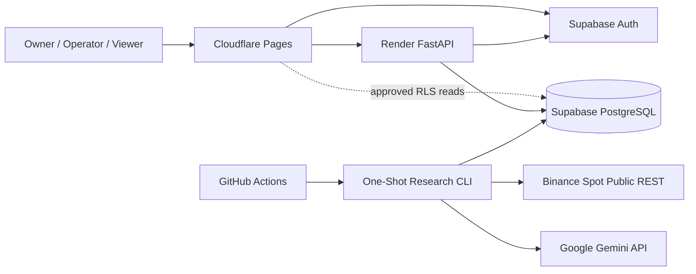
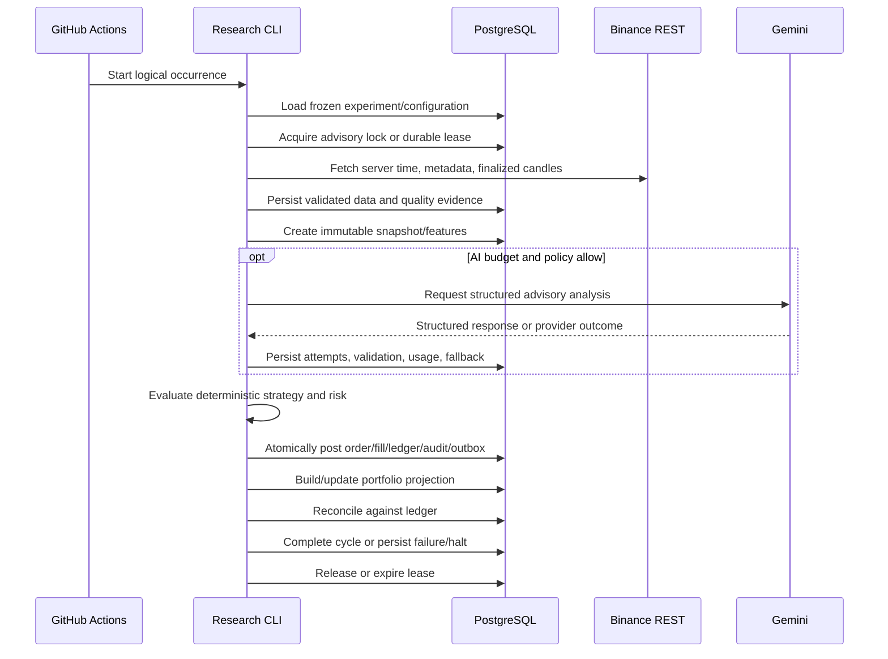

# Architecture

Last reviewed: 2026-08-01  
Status: Authoritative paper-research architecture mapped to `M001–M036`

## 1. Goals

The architecture separates probabilistic Gemini interpretation from deterministic strategy, risk, execution, accounting, experiment control, and release governance.

It must support:

- deterministic local development and CI without cloud or paid credentials;
- a free-cloud paper experiment without the owner’s computer remaining online;
- reproducible backtesting and paper execution;
- append-only financial and audit evidence;
- safe degradation during provider and free-tier failures;
- isolated staging and production-grade research operation;
- human-controlled promotion and behavior changes;
- no live trading or private exchange execution.

## 2. Master-Task Ownership

| Architecture area | Master Tasks |
|---|---|
| repository, toolchains, local platform, frontend foundation, core infrastructure, fakes | M001–M006 |
| market data, features, Gemini, strategy/risk, execution/accounting, cycle, backtesting | M007–M013 |
| API and product workspaces | M014–M025 |
| integrated verification and recovery | M026–M027 |
| free-cloud deployment and experiment | M028–M029 |
| performance, data, research, incidents, and change governance | M030–M034 |
| staging and production research | M035–M036 |

A task file or architecture note cannot activate a component before its Master Task dependencies are verified.

## 3. Architectural Style

The codebase is a modular monolith with project-owned domain and application boundaries.

Active runtime entry points:

- stateless FastAPI web process;
- one-shot research-cycle CLI;
- static React/TypeScript frontend;
- managed PostgreSQL/Auth;
- external best-effort GitHub Actions schedule.

The API and CLI reuse the same application and domain services. The active profile does not require a persistent queue or worker.

## 4. System Context



Direct browser access to Supabase is limited to authentication and approved RLS-protected reads. All material commands pass through application services.

## 5. Repository and Package Boundaries

```text
backend/app/
├── main.py
├── api/
├── cli/
├── core/
├── application/
├── domains/
│   ├── identity/
│   ├── workspaces/
│   ├── configuration/
│   ├── market_data/
│   ├── features/
│   ├── ai_analysis/
│   ├── strategy/
│   ├── risk/
│   ├── execution/
│   ├── portfolio/
│   ├── backtesting/
│   ├── experiments/
│   ├── research_cycles/
│   ├── data_governance/
│   ├── research_review/
│   ├── incidents/
│   ├── changes/
│   ├── releases/
│   ├── audit/
│   └── reporting/
└── infrastructure/
    ├── persistence/postgres/
    ├── auth/supabase/
    ├── exchange/binance/
    ├── ai/gemini/
    ├── scheduling/external/
    ├── exports/
    └── observability/

frontend/src/
├── app/
├── routes/
├── features/
├── components/
├── design-system/
├── api/
├── i18n/
├── accessibility/
└── test/

ai/
├── prompts/
├── schemas/
├── evaluations/
└── fixtures/

supabase/
├── config.toml
├── migrations/
├── functions/
├── seed.sql
└── tests/
```

Domain code does not depend on FastAPI, SQLAlchemy ORM models, Supabase SDK types, Binance SDK types, Gemini SDK types, or frontend types.

## 6. Layering

### Domain Layer

Contains entities, value objects, invariants, state machines, policies, domain events, and project-owned protocols. It performs no network or framework work.

### Application Layer

Owns use cases, transaction boundaries, authorization decisions, idempotency, expected-version guards, orchestration, audit/outbox coordination, and result models.

### Infrastructure Layer

Implements persistence, Auth verification, Binance REST, Gemini, exports, clocks, identifiers, and observability adapters.

### API and CLI Layers

Validate transport input, resolve actor/context, call application services, map safe errors, and serialize project-owned output. They contain no domain logic.

### Frontend

Consumes versioned APIs/read models, presents authorized evidence, and invokes explicit commands through normal gates. It does not calculate authoritative risk, accounting, reconciliation, permission, SLO, cost, or compatibility outcomes.

## 7. Primary Research-Cycle Flow



A successful process exit is insufficient. A financial cycle is complete only when every required stage, atomic financial effect, audit closure, and reconciliation result exists.

## 8. Scheduling and Concurrency

GitHub Actions is an external best-effort scheduler for M028–M029.

- intended occurrence and actual start are separate;
- a database lock or lease enforces single ownership;
- stable idempotency keys cover each logical side effect;
- duplicate delivery returns existing results or a deterministic conflict;
- delayed execution uses actual eligible finalized data;
- missed cycles are recorded and never reconstructed as imagined trades;
- Render availability does not control scheduled execution.

## 9. Market Data Boundary

The active profile uses Binance Spot public REST for:

- server time;
- exchange/symbol metadata;
- finalized candles;
- bounded checkpointed backfill and gap repair.

Only approved, fresh, finalized evidence may feed features, AI, strategy, risk, paper execution, or backtests. Corrections create explicit replacement and downstream invalidation lineage.

Persistent WebSocket ingestion is deferred.

## 10. Gemini Boundary

Gemini receives minimum approved structured evidence and has no tools or authority to:

- access secrets or personal data;
- mutate the database;
- execute code or shell commands;
- call exchange order endpoints;
- size positions;
- alter strategy, risk, experiments, releases, or configuration;
- approve promotion or behavior activation.

Provider success is distinct from application validation acceptance. Invalid, blocked, unsafe, unsupported, stale, malformed, unavailable, or budget-blocked output uses deterministic fallback or HOLD.

## 11. Strategy, Risk, Execution, and Accounting

- strategies emit immutable typed intents;
- every non-HOLD intent passes deterministic risk;
- risk approves, reduces, rejects, or halts;
- one approved risk evaluation creates at most one paper order;
- paper execution applies versioned timing, fees, spread, slippage, precision, minimum notional, partial fills, and cancellation rules;
- fills, order transitions, ledger entries, audit/outbox, and projection effects commit atomically;
- the append-only double-entry ledger is the financial source of truth;
- projections are rebuildable and must reconcile;
- mismatch halts new entry activity.

No network call occurs inside a financial transaction.

## 12. Backtesting Boundary

Backtests reuse the same strategy, risk, execution, and accounting contracts.

They enforce:

- finalized historical data;
- no look-ahead;
- next-event timing;
- fees and slippage;
- cash and buy-and-hold benchmarks;
- explicit train/validation/untouched-test or walk-forward evidence;
- reproducibility manifests;
- no silent live Gemini calls;
- final reconciliation before a result is complete.

## 13. Experiment and Behavior Freeze

A running experiment references immutable:

- workspace/configuration version;
- market and feature versions;
- Gemini provider/model/prompt/schema/safety/validation/fallback versions;
- strategy and risk versions;
- execution and accounting versions;
- schedule, budget, retention, code, dependency, and migration versions;
- aggregate behavior-set hash.

A running experiment never silently adopts a new version. Safety actions may pause or halt it without rewriting historical behavior.

Material changes use M034 proposal, impact, evidence, approval, staged paper rollout, stop conditions, rollback, and future-configuration activation.

## 14. Data Ownership

PostgreSQL is authoritative. Render and GitHub runner filesystems are disposable.

| Domain | Authoritative records |
|---|---|
| Identity/access | Supabase subject mapping, memberships, effective permissions, assurance evidence |
| Configuration | immutable versions, dependencies, behavior sets, approvals |
| Market/data | symbols, candles, quality events, snapshots, datasets, lineage, retention |
| AI | provider/prompt/schema versions, attempts, validation, reports, usage, budgets |
| Strategy/risk | versions, evaluations, reason codes, halts |
| Execution | paper orders, fills, reservations, state transitions |
| Portfolio | append-only ledger, state versions, reconciliations, rebuild evidence |
| Backtesting/research | runs, events, metrics, benchmarks, variants, reviews |
| Experiments/operations | experiments, cycles, locks, incidents, exports, recovery |
| Governance/releases | findings, exceptions, migrations, release gates, deployments, changes |
| Audit | immutable material-action and system-event evidence |

## 15. Auth and Database Access

- Supabase Auth establishes identity.
- FastAPI/application handlers enforce owner/operator/viewer and resource-scope authorization.
- recent authentication is required where policy specifies it.
- RLS is enabled on every Data API-visible object and denies by default.
- browser writes to financial, AI, audit, experiment-control, access, incident, release, and change-management tables are prohibited.
- approved read views expose only authorized fields.
- service/workflow, read-only, application, and migration identities remain separated.
- applied migrations are immutable.

## 16. FastAPI Boundary

Render hosts FastAPI for authorized reads and explicit commands.

FastAPI:

- verifies Supabase identity evidence;
- applies application authorization;
- validates project-owned schemas;
- requires idempotency/expected-version/recent-auth gates as applicable;
- returns stable safe errors and correlation IDs;
- exposes liveness and dependency-aware readiness;
- does not own the schedule;
- does not store authoritative local files;
- does not start a duplicate worker.

## 17. Idempotency and Atomicity

Stable identities cover at minimum:

- logical cycle occurrence;
- market ingestion page and correction;
- snapshot and feature calculation;
- Gemini logical request/attempt;
- strategy and risk evaluation;
- order, fill, reservation, ledger transaction, and state version;
- backtest and report;
- lifecycle command, export, incident, approval, and rollout stage.

Retries never duplicate a financial or control side effect.

## 18. Failure and Recovery Policy

| Failure | Required behavior |
|---|---|
| delayed/missed schedule | record evidence; use actual eligible data; no imagined trades |
| overlapping workflow | only one lock owner; duplicate attempt exits safely |
| Render sleeping | show startup state; schedule remains independent |
| database unavailable | fail closed; no side effect |
| Binance unavailable/stale | block entry and preserve quality evidence |
| Gemini unavailable/quota/invalid | deterministic fallback or HOLD |
| risk or configuration invalid | reject or halt according to policy |
| partial financial transaction | roll back atomically |
| ledger/reconciliation mismatch | halt and create critical incident evidence |
| migration mismatch | readiness/deployment fails |
| export/restore failure | block the applicable experiment/release gate |
| secret/Auth/RLS failure | contain, incident, rotate/fix, verify, and block unsafe operation |

Recovery preserves original evidence and never fabricates missing domain records.

## 19. Observability and Operations

The free profile uses:

- structured logs;
- persistent cycle and stage records;
- data-quality, AI validation, risk, halt, ledger, reconciliation, incident, export/restore, audit, and release evidence;
- GitHub Actions, Render, and Supabase operational logs;
- frontend safety/status views.

M030 adds versioned SLIs, SLOs, error budgets, cost, quota, capacity, and resilience evidence. Profit is never an SLI or SLO.

Hosted Prometheus/Grafana and OpenTelemetry are deferred options, not completion assumptions.

## 20. Architectural Invariants

1. Gemini never executes trades or mutates control state.
2. Strategies never place orders.
3. Every actionable intent passes deterministic risk.
4. Risk and missing safety configuration fail closed.
5. PostgreSQL is authoritative.
6. The append-only ledger is the financial source of truth.
7. Money uses decimal arithmetic and explicit units.
8. Finalized decision inputs and used versions are immutable.
9. Side effects are idempotent.
10. Financial effects commit atomically.
11. Portfolio state rebuilds and reconciles.
12. Scheduled execution does not depend on Render or a local computer.
13. Free-tier/provider failure degrades safely.
14. A running experiment retains its behavior-set hash.
15. Tests, AI, CI, scores, or browser controls cannot auto-approve or activate behavior.
16. No provider plan or infrastructure is purchased/scaled automatically.
17. Private Binance and live trading remain disabled.

## 21. Architecture Evolution

Redis/ARQ, persistent workers, WebSocket ingestion, managed metrics/tracing, paid/high-availability services, object storage, or other runtime changes require:

- measured M030 need;
- M034 change proposal and immutable before/after behavior sets;
- ADR;
- security/privacy and data review;
- migration, compatibility, rollback/forward-fix planning;
- cost/capacity evidence;
- tests and resilience drills;
- isolated staged paper verification;
- owner approval.

Private exchange or live-capital work additionally requires a separate future milestone.

## 22. Related Documents

- `/TASKS.md`
- `IMPLEMENTATION_EXECUTION_PLAN.md`
- `TASK_CATALOG_INDEX.md`
- `BACKEND.md`
- `TECH_STACK.md`
- `FREE_CLOUD_ARCHITECTURE.md`
- `DEPLOYMENT.md`
- `PRODUCT_REQUIREMENTS.md`
- `SECURITY.md`
- `OBSERVABILITY.md`
- `CHANGE_MANAGEMENT_ROLLOUT_GOVERNANCE_WORKSPACE_IMPLEMENTATION.md`
