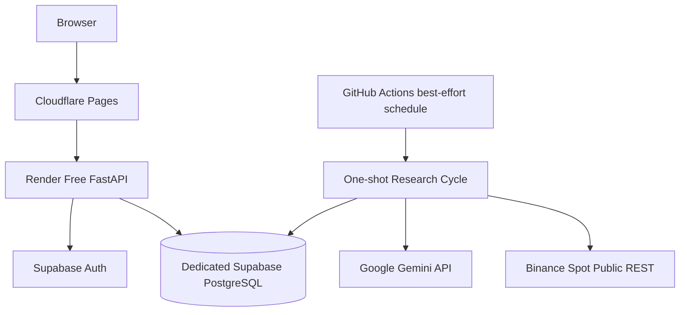

# Deployment

Last reviewed: 2026-08-01  
Status: Authoritative environment and deployment specification mapped to `TASKS.md`

## 1. Deployment Objective

Build and promote The Daily Roast AI from a deterministic local implementation to a free-cloud demonstration, a controlled paper experiment, isolated staging, and a production-grade research service.

Deployment does not authorize live trading, private Binance execution, withdrawals, custody, leverage, margin, futures, options, or shorting.

## 2. Canonical Deployment Sequence

```text
M001–M025  Build domains, API, UI, governance, and developer evidence
M026       Integrated local/CI verification
M027       Export, restore, recovery, and security gate
M028       Free-cloud infrastructure and deployment
M029       Controlled paper experiment
M030–M034  Evidence hardening and governance
M035       Post-experiment decision and isolated staging
M036       Production research launch and continuous operation
Future     Separate Binance test/private or live-capital assessment
```

No later environment can compensate for an unverified earlier gate. Favorable performance cannot skip verification, restore, staging, or approval.

## 3. Active Free-Cloud Topology



Render hosts authenticated reads and explicit commands. It is not the experiment scheduler. The scheduled cycle must continue independently of Render sleep or cold start.

## 4. Environment Responsibilities

### Local — M001–M025

- local Supabase/PostgreSQL and Auth;
- deterministic fake Binance and Gemini by default;
- no cloud project or paid credential required;
- one-shot research cycle;
- Windows 11 and Unix-like command paths;
- synthetic fixtures and isolated state;
- complete domain/API/UI development.

See `LOCAL_DEVELOPMENT.md`.

### CI and Integrated Verification — M002, M026, M027

- ephemeral/resettable database/Auth;
- fake providers;
- migrations, RLS, Auth, unit, property, integration, contract, frontend, accessibility, E2E, security, documentation, and generated-artifact checks;
- export, isolated restore, ledger rebuild, reconciliation, and recovery drills;
- no production data, paid Gemini, or private Binance credential.

See `TEST_ENVIRONMENTS.md` and `TESTING.md`.

### Free-Cloud Demo — M028

- dedicated Supabase project separate from Eventnexus;
- Cloudflare Pages frontend;
- Render Free FastAPI;
- GitHub Actions one-shot scheduling;
- Binance public REST;
- fake or bounded Gemini;
- approved domains, HTTPS, CORS, CSP, Auth redirects, and secret isolation;
- no Redis, ARQ, persistent worker, mandatory WebSocket, hosted Prometheus/Grafana, or live/private exchange path.

### Controlled Paper Experiment — M029

- exact frozen configuration and behavior-set hashes;
- virtual EUR 20 baseline unless an approved configuration states otherwise;
- BTC/EUR one-hour finalized candles;
- approximately hourly best-effort cycles;
- deterministic risk limits and halts;
- append-only ledger and reconciliation;
- incidents, status, exports, restore, and final report;
- owner approval and auditable terminal state.

### Evidence Hardening — M030–M034

- measured performance, SLO, quota, cost, and capacity evidence;
- dataset lifecycle and lineage governance;
- research review and strategy lifecycle;
- incident/postmortem/corrective-action controls;
- governed behavior changes and staged paper canaries.

### Staging — M035

- separate database, Auth, Gemini key, domains, storage, deployment credentials, and synthetic data;
- immutable production build artifacts;
- migration rehearsal and compatibility window;
- restore, rollback/forward-fix, E2E, load, failure, accessibility, security, privacy, content, and runbook validation;
- protected access and bounded provider/cost use.

### Production Research — M036

- separate managed environment;
- protected CI/CD and manual approval;
- controlled migration step;
- immutable artifact and release evidence;
- managed backup and tested restore;
- measured SLOs, capacity, cost, incident routing, support, and status communication;
- authenticated research, backtesting, audit, and paper portfolios;
- live trading disabled.

## 5. Service Responsibilities

### Cloudflare Pages

Hosts the static React/Vite build. Client assets contain only allowlisted public values and no server secrets.

### Render

Hosts the FastAPI read/command application. It does not run the authoritative schedule or store authoritative local files.

### Supabase

Provides PostgreSQL and Auth. Critical financial and control tables are server/workflow-only. Browser access is deny-by-default and limited to approved RLS-protected reads.

### GitHub Actions

Runs manually dispatchable and scheduled one-shot cycles. Workflow concurrency and a database lock/lease prevent overlapping side effects.

### Binance

Provides public Spot REST market data only. No private credential or order endpoint is used in M001–M036.

### Google Gemini

Provides bounded structured advisory analysis. It has no execution or state-mutation tools. Provider failure degrades to deterministic fallback or HOLD.

### Future Worker or Queue Platform

A persistent worker, Redis/ARQ, WebSocket ingestion, or managed metrics platform requires M034 change governance, measured need from M030, ADR, migration/rollback, security/privacy, cost, testing, staged verification, and owner approval.

## 6. Research-Cycle Deployment Contract

The one-shot command:

1. loads the frozen experiment configuration;
2. acquires a PostgreSQL lock or durable lease;
3. fetches actual eligible finalized candles;
4. repairs approved gaps;
5. creates snapshot and features;
6. checks AI budget and optionally calls Gemini;
7. validates or rejects AI output;
8. evaluates strategy and risk;
9. simulates approved paper execution;
10. atomically posts order/fill/ledger/audit effects;
11. updates/rebuilds the portfolio projection;
12. reconciles;
13. persists cycle status and releases the lock.

Retries never duplicate a financial side effect. Delayed schedules use actual eligible market data and never create imagined trades.

## 7. Secrets and Environment Isolation

Each environment uses separate credentials and scopes.

Public frontend values are limited to approved API/Supabase public configuration. The following remain server/workflow-only:

- service-role keys;
- direct database credentials;
- Gemini keys;
- signing material;
- deployment credentials;
- future exchange credentials.

Secrets never appear in source, images, client bundles, logs, prompts, responses, telemetry, screenshots, fixtures, or artifacts.

## 8. Database and Migrations

- every schema change is a committed additive migration;
- applied migrations are immutable;
- clean rebuild and drift checks are mandatory;
- RLS is deny-by-default;
- browser direct writes to critical tables are prohibited;
- cloud database auto-deploy remains disabled until migration CI and controlled deployment exist;
- staging rehearses production migrations;
- production migration runs once through a protected step;
- destructive changes use expand-migrate-contract and forward-fix planning;
- application rollback compatibility is documented.

## 9. Backup, Export, and Restore

### Before M028/M029

M027 must prove logical export, isolated restore, migration revision, evidence hashes, ledger rebuild, and reconciliation.

### Free Cloud

Use documented exports at an approved cadence. Free-tier provider backup limitations are disclosed and never overstated.

### Staging and Production Research

Require automated encrypted backups where selected, documented retention, tested restore, approved measured RPO/RTO, backup-failure handling, and post-restore reconciliation.

A backup is not accepted until restore succeeds.

## 10. Observability

### Free Profile

Use structured Render/GitHub/Supabase logs plus persistent cycle, audit, data-quality, halt, incident, and reconciliation records. The UI exposes last attempt/success, freshness, AI/fallback, risk, halt, reconciliation, and dependency state.

### Production Research

Use approved centralized logs, error aggregation, metrics, uptime checks, database/provider monitoring, SLI/SLO/error budgets, incident routing, status communication, and tested runbooks.

Prometheus/Grafana remain optional future implementations rather than assumed completed work.

## 11. Failure Behavior

| Failure | Required behavior |
|---|---|
| Render asleep/cold | UI shows startup; scheduled cycle remains independent |
| GitHub schedule delayed | record intended/actual time; use actual eligible data |
| cycle overlap | one lease owner; others exit safely |
| database unavailable | fail closed; no financial side effect |
| Binance unavailable/stale | mark stale; block entry |
| Gemini unavailable/quota exhausted | deterministic fallback or HOLD |
| risk/integrity/reconciliation failure | halt and preserve evidence |
| migration failure | stop deployment and keep compatible prior service |
| export/backup failure | create blocker according to environment policy |
| secret exposure | contain, rotate/revoke, verify, and block unsafe release |
| staging/production smoke failure | roll back or halt according to approved plan |

## 12. M028 Free-Cloud Deployment Sequence

Prerequisites: M001–M027 verified.

1. create dedicated Supabase cloud project;
2. configure controlled cloud migrations, Auth, and RLS;
3. configure environment secrets/variables;
4. configure scheduled/manual GitHub one-shot workflow;
5. deploy FastAPI to Render;
6. deploy frontend to Cloudflare Pages;
7. configure approved domains and security policies;
8. run Auth, RLS, API, frontend, cold-start, schedule, secret, export, and restore smoke checks;
9. record deployment revision, migration head, artifact hashes, and limitations.

## 13. M029 Experiment Sequence

1. verify cloud observability and runbooks;
2. repeat export/restore evidence at required freshness;
3. freeze exact experiment configuration and behavior set;
4. run preflight against the exact hash;
5. obtain owner approval;
6. start and verify the first scheduled cycle;
7. monitor cycle, market, AI, risk, ledger, reconciliation, incidents, quotas, and exports;
8. pause or halt according to policy;
9. close final cycle and reconcile;
10. export evidence and generate final report;
11. record terminal state and owner decision.

## 14. M035 Staging Sequence

1. build immutable release artifacts;
2. provision isolated staging;
3. restore or seed safe synthetic state;
4. rehearse migrations and compatibility;
5. deploy the release candidate;
6. run smoke, E2E, accessibility, load, failure, security, privacy, restore, rollback, and content checks;
7. verify alerts, incidents, costs, quotas, and runbooks;
8. obtain release-candidate approval.

## 15. M036 Production-Research Sequence

1. pass protected CI and M035 evidence;
2. obtain manual environment approval;
3. verify backup, restore, rollback, capacity, cost, and incident readiness;
4. run the controlled migration once;
5. deploy immutable artifacts;
6. run health, Auth, RLS, smoke, and reconciliation checks;
7. verify alerts, support, status, and release metadata;
8. roll back or halt on any critical failure;
9. operate continuous reviews and route material changes through M034.

## 16. Promotion Gates

- **M026:** integrated deterministic local/CI product works;
- **M027:** restore/recovery/security gate passes;
- **M028:** free-cloud deployment is functional and isolated;
- **M029:** formal experiment closes with complete evidence;
- **M030–M034:** reliability, data, research, incident, and change governance is verified;
- **M035:** production-like staging release candidate passes;
- **M036:** protected production-research launch passes.

No gate authorizes live trading.

## 17. Future Exchange Execution Separation

Binance test/private access and live-capital execution are outside this deployment specification. Each requires a separate owner-approved milestone covering legal/exchange eligibility, credential protection, order/reconciliation contracts, real-loss limits, independent security/accounting review, incident response, emergency disablement, tax/record obligations, and staged verification.

## 18. Related Documents

- `/TASKS.md`
- `IMPLEMENTATION_EXECUTION_PLAN.md`
- `TASK_CATALOG_INDEX.md`
- `LOCAL_DEVELOPMENT.md`
- `TEST_ENVIRONMENTS.md`
- `FREE_CLOUD_ARCHITECTURE.md`
- `PRODUCTION_DEVELOPMENT.md`
- `SECURITY.md`
- `OBSERVABILITY.md`
- `/CLOUD_MVP_TASKS.md`
- `/LOCAL_AND_PRODUCTION_TASKS.md`
