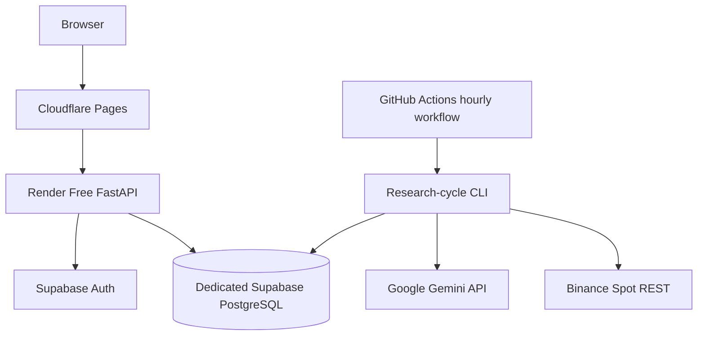

# Deployment

Last reviewed: 2026-07-31
Status: Authoritative environment and deployment specification

## 1. Deployment Objective

The first MVP must run without a local computer and without a required monthly infrastructure payment. It is an experimental paper-trading environment, not a production SLA deployment.

The full development path is:

```text
Local -> CI -> Free Cloud Demo -> 30-Day Paper Experiment -> Staging -> Production Research
```

Production research does not authorize private Binance execution or real-money trading.

## 2. Free Cloud Topology



## 3. Environment Responsibilities

### Local

- Supabase CLI for PostgreSQL, Auth, migrations, RLS, and seed data;
- FastAPI and React development servers;
- fake Binance and Gemini by default;
- deterministic one-shot research cycle;
- no paid credentials required;
- cross-platform commands including Windows 11 support.

See `LOCAL_DEVELOPMENT.md`.

### CI

- resettable local Supabase or PostgreSQL-compatible test environment;
- fake providers;
- migrations, RLS, Auth, unit, property, integration, contract, frontend, E2E, security, and documentation checks;
- no access to production data or secrets.

See `TEST_ENVIRONMENTS.md`.

### Free Cloud Demo and Paper Experiment

- Cloudflare Pages for frontend;
- Render Free for FastAPI;
- dedicated Supabase Free for PostgreSQL and Auth;
- GitHub Actions for one-shot scheduling;
- Binance public REST and bounded Gemini usage;
- no Redis, ARQ, persistent WebSocket worker, hosted Prometheus, or hosted Grafana.

### Staging

- separate database, Auth, Gemini key, domains, and deployment credentials;
- production build artifacts;
- synthetic data;
- migration rehearsal;
- protected provider smoke calls;
- E2E, load, failure, security, and restore testing;
- reset without production impact.

### Production Research

- separate managed environment;
- protected CI/CD and manual approval;
- managed backups and tested restore;
- measured SLOs and incident routing;
- security and privacy review;
- authenticated research and paper trading only;
- live trading disabled.

See `PRODUCTION_DEVELOPMENT.md`.

## 4. Service Responsibilities

### Cloudflare Pages

Hosts the static React/Vite build. It contains no server secrets.

### Render

Hosts FastAPI reads and explicit commands in the free profile. It is not the experiment scheduler. Cold starts must not stop scheduled research.

### Supabase

Provides PostgreSQL and Auth. A dedicated AI Trade Bot project is mandatory. Critical financial tables are server-only; browser access is limited to approved RLS-protected views.

### GitHub Actions

Runs manually dispatchable and scheduled one-shot research cycles. Workflow concurrency and database leases prevent overlap.

### Future Production Worker Platform

A persistent worker, queue, or WebSocket service may be introduced only after measured need and an accepted ADR.

## 5. Research-Cycle Requirements

The one-shot command fetches finalized candles, repairs gaps, calculates features, optionally calls Gemini, evaluates strategy and risk, simulates paper execution, posts ledger entries, reconciles state, and persists audit results.

It must be idempotent, restart-safe, and independent of local disk, Render availability, Redis, ARQ, and WebSocket in the free profile.

## 6. Secrets and Environment Isolation

Each environment uses separate credentials. Public frontend variables are limited to API base URL, Supabase URL, and publishable key.

Never expose service-role keys, database credentials, Gemini keys, JWT signing material, or future Binance secrets in frontend builds, logs, fixtures, or source control.

## 7. Database and Migrations

- all schema changes are committed migrations;
- clean rebuild and migration drift checks are mandatory;
- RLS is deny-by-default;
- applied migrations are immutable;
- cloud database auto-deploy remains disabled until migration CI exists;
- staging rehearses production migrations;
- production migration runs once through a controlled protected job;
- destructive changes use expand-migrate-contract where appropriate.

## 8. Backup and Restore

### Free Cloud

Use documented logical exports at a defined cadence and test restore into an isolated project or local environment.

### Production Research

Require automated encrypted backups, retention, tested restore, approved RPO/RTO, backup failure alerts, and ledger reconciliation after recovery.

A backup is not accepted until restore succeeds.

## 9. Observability

### Free Profile

Use structured Render logs, GitHub Actions logs/artifacts, Supabase logs, persistent cycle/audit/halt/reconciliation records, and frontend freshness status.

### Production Research

Use centralized logs, error aggregation, metrics, uptime checks, provider cost/quota alerts, database monitoring, SLO dashboards, incident routing, and tested runbooks.

## 10. Failure Behavior

| Failure | Required behavior |
|---|---|
| Render asleep | UI shows startup state; scheduled research remains independent |
| GitHub schedule delayed | record actual start; use valid finalized data only |
| overlapping cycle | one database lease owner; others exit safely |
| database unavailable | fail closed; no financial side effect |
| Binance unavailable | mark stale; block entries |
| Gemini unavailable or quota exhausted | deterministic fallback or HOLD |
| integrity or reconciliation error | halt and exit non-zero |
| failed migration | stop deployment and preserve prior compatible application |
| backup failure | alert and block production promotion according to policy |

## 11. Deployment Sequences

### Free Demo

1. Complete local and CI foundations.
2. Create dedicated Supabase project.
3. Apply migrations and RLS.
4. Deploy FastAPI to Render.
5. Deploy frontend to Cloudflare Pages.
6. Add GitHub Actions research cycle.
7. Verify Auth, CORS, RLS, idempotency, cold start, export, and restore.

### Staging

1. Build immutable artifacts.
2. Deploy to isolated staging.
3. Rehearse migrations.
4. Run smoke, E2E, load, failure, security, and restore checks.
5. Approve release candidate.

### Production Research

1. Pass protected CI gates.
2. Obtain manual environment approval.
3. Verify backup and rollback compatibility.
4. Run migration once.
5. Deploy immutable artifacts.
6. Run health, smoke, Auth, and reconciliation checks.
7. Verify alerts and release metadata.
8. Roll back or halt if any critical check fails.

## 12. Promotion Gates

- **Local to Demo:** clean bootstrap, migrations, seed, fake-provider flow, tests, and no secrets.
- **Demo to Paper Experiment:** RLS, idempotency, risk, ledger, restore, freshness, and observability checks.
- **Paper Experiment to Staging:** post-experiment review and explicit owner decision.
- **Staging to Production Research:** protected CI/CD, backups, measured SLOs, security/privacy review, incident readiness, and manual approval.
- **Production Research to Binance Sandbox:** separate future specification and approval.

## 13. Related Documents

- `LOCAL_DEVELOPMENT.md`
- `TEST_ENVIRONMENTS.md`
- `FREE_CLOUD_ARCHITECTURE.md`
- `PRODUCTION_DEVELOPMENT.md`
- `TECH_STACK.md`
- `SECURITY.md`
- `OBSERVABILITY.md`
- `../CLOUD_MVP_TASKS.md`
- `../LOCAL_AND_PRODUCTION_TASKS.md`
