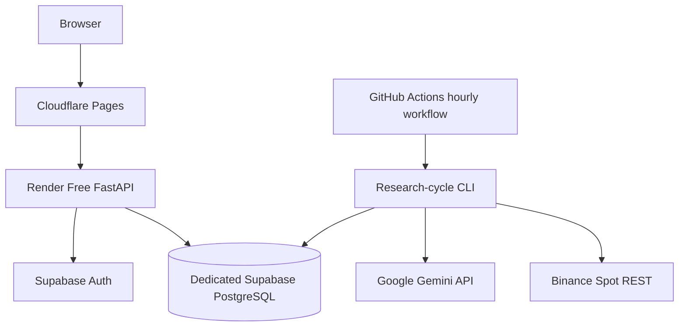

# Deployment

Last reviewed: 2026-07-31
Status: Authoritative zero-cost cloud deployment specification

## 1. Deployment Objective

The first MVP must run without a local computer and without a required monthly infrastructure payment. It is an experimental paper-trading environment, not a production SLA deployment.

## 2. Selected Topology

## 3. Environments

### Local

Local development uses Python, frontend tooling, fake providers, and either local PostgreSQL or Supabase CLI. Docker Compose may be used for development but is not required to keep the experiment running.

### CI

CI uses fake Gemini and Binance adapters plus an ephemeral PostgreSQL-compatible test environment. Ordinary pull requests must not access the research database or paid APIs.

### Cloud Research Environment

- Cloudflare Pages for frontend;
- Render Free Web Service for FastAPI;
- a dedicated Supabase Free project for PostgreSQL and Auth;
- GitHub Actions for the scheduled one-shot research cycle;
- Binance public REST and Gemini free allowance;
- no Redis, ARQ, persistent WebSocket worker, hosted Prometheus, or hosted Grafana.

### Future Binance Test Environment

Private Binance access remains a separate future milestone after the paper experiment and a dedicated security review.

## 4. Service Responsibilities

### Cloudflare Pages

Hosts the static React/Vite build. It contains no server secrets.

### Render

Hosts FastAPI read APIs and explicit commands. Render is not the experiment scheduler. Cold start, restart, or idle spin-down must not stop the GitHub Actions research cycle.

### Supabase

Provides PostgreSQL and Auth. A new project dedicated to AI Trade Bot is mandatory. The unrelated Eventnexus project must not be reused.

Critical financial tables are server-only. Browser access is limited to approved RLS-protected read views.

### GitHub Actions

Runs a manually dispatchable and scheduled hourly research-cycle CLI. Workflow concurrency and a database advisory lock prevent overlap.

## 5. Research-Cycle Requirements

The one-shot command must fetch finalized REST candles, repair gaps, calculate features, optionally call Gemini, evaluate strategy and risk, simulate paper execution, post ledger entries, reconcile state, and persist audit results.

It must be idempotent and restart-safe. It must not require Redis, ARQ, WebSocket, Render availability, or local disk.

## 6. Secrets

### GitHub Actions secrets

- database/service connection secret;
- Gemini API key;
- Supabase service credentials when required by the CLI;
- environment identifier.

### Render secrets

- Supabase/database connection;
- JWT verification configuration;
- server-only application secrets.

### Cloudflare Pages public variables

- `VITE_API_BASE_URL`;
- `VITE_SUPABASE_URL`;
- `VITE_SUPABASE_PUBLISHABLE_KEY`.

Never expose the Supabase service-role key, database password/URL, Gemini key, JWT signing material, or future Binance secret in the frontend.

## 7. Database and Migrations

- schema changes are committed under `supabase/migrations/` or an approved migration directory;
- a fresh database must rebuild from migrations;
- RLS is deny-by-default;
- production auto-deploy remains disabled until migration CI passes;
- only one controlled migration job applies a release;
- already-applied migrations are never edited.

## 8. Backups and Restore

Free plans do not provide production backup guarantees. Before the formal experiment:

- document a database export command;
- export before experiment start and at a defined cadence;
- test restore into a separate project or local instance;
- verify migration revision and ledger reconciliation after restore;
- store exports securely and never commit sensitive data.

## 9. Observability

The free profile uses:

- structured Render logs;
- GitHub Actions workflow logs and artifacts;
- Supabase logs;
- persistent `research_cycles`, audit, halt, and reconciliation records;
- frontend status showing last successful cycle and data freshness.

Hosted Prometheus and Grafana are deferred. Their absence must not be represented as completed observability work.

## 10. Failure Behavior

| Failure | Required behavior |
|---|---|
| Render asleep | UI shows startup state; scheduled research continues independently |
| GitHub schedule delayed | record actual start time; process only valid finalized data |
| overlapping workflow | database lock allows only one cycle |
| Supabase paused/unavailable | fail safely; no financial side effect |
| Binance unavailable | mark data stale and block entries |
| Gemini unavailable/quota exhausted | deterministic fallback or HOLD |
| integrity/reconciliation error | halt and exit non-zero |
| local filesystem loss | no effect on authoritative state |

## 11. Deployment Sequence

1. Complete repository and quality foundation.
2. Create a dedicated Supabase project.
3. Commit migrations and RLS policies.
4. Implement and test the one-shot research-cycle CLI.
5. Add scheduled GitHub Actions workflow.
6. Deploy FastAPI to Render.
7. Deploy React to Cloudflare Pages.
8. Test auth, CORS, RLS, idempotency, cold starts, export, and restore.
9. Freeze the experiment configuration.
10. Start the 30-day paper experiment.

## 12. Promotion Gate

The free-cloud environment is ready when it has public HTTPS frontend/API URLs, reproducible migrations, secure RLS, an hourly cycle that runs while the local computer is off, demonstrated duplicate protection, restore evidence, and visible experiment freshness/status.

## 13. Free-Tier Limitations

Free services may sleep, pause, restart, throttle, delay work, or change quotas. Do not claim production readiness or guaranteed uptime. Accounting integrity and safe degradation take priority over continuity.

## 14. Related Documents

- `FREE_CLOUD_ARCHITECTURE.md`
- `TECH_STACK.md`
- `ARCHITECTURE.md`
- `SECURITY.md`
- `OBSERVABILITY.md`
- `../CLOUD_MVP_TASKS.md`
