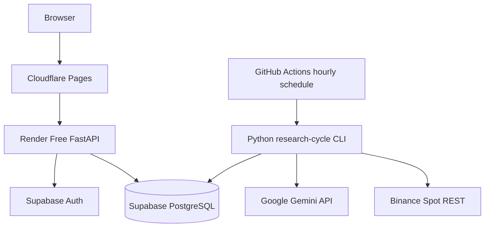

# Free Cloud Architecture

Last reviewed: 2026-07-31
Status: Authoritative deployment profile for the first 30-day experiment

## Objective

Run the research MVP in the cloud without depending on a local computer and without a required monthly infrastructure payment. Free tiers are best-effort and may pause, throttle, or change; this profile is for experimentation, not production availability.

## Selected Services

| Capability | Service | MVP role |
|---|---|---|
| Static frontend | Cloudflare Pages Free | Hosts the React/Vite build |
| HTTP backend | Render Free Web Service | Hosts FastAPI read and command APIs |
| PostgreSQL and Auth | A dedicated Supabase Free project | Authoritative database and user authentication |
| Scheduled research cycle | GitHub Actions | Runs the hourly Python CLI workflow |
| AI analysis | Google Gemini API free allowance | Structured advisory market analysis |
| Market data | Binance Spot public REST API | Finalized candle and symbol data |
| Source and CI | GitHub | Repository, workflows, checks, and artifacts |

A dedicated Supabase project must be created for this repository. Do not reuse an unrelated product database.

## Deliberate MVP Simplifications

The free-cloud experiment does not require:

- Redis;
- ARQ;
- a continuously running scheduler;
- a persistent Binance WebSocket consumer;
- hosted Prometheus or Grafana;
- Kubernetes;
- private Binance credentials;
- live trading.

These remain future architecture options and require an ADR before activation.

## Runtime Topology



## Research-Cycle Execution

GitHub Actions runs one idempotent CLI cycle approximately once per hour, using a non-zero minute offset such as `7 * * * *`.

Each cycle:

1. acquires a PostgreSQL advisory lock or equivalent database lease;
2. loads Binance server time and finalized candles through REST;
3. repairs candle gaps;
4. creates an immutable snapshot;
5. calculates versioned features;
6. calls Gemini only when the configured budget allows it;
7. validates the structured report;
8. evaluates deterministic strategy and risk;
9. simulates any approved paper action;
10. posts ledger entries atomically;
11. reconciles the portfolio;
12. writes audit and cycle-status records;
13. releases the lease.

The CLI exits non-zero on integrity failure. Retries must not duplicate a financial side effect.

## Render Backend Boundary

Render hosts FastAPI only. It provides authenticated reads and explicit user commands. It is not the authoritative scheduler and the 30-day experiment must continue even when the free web service has spun down.

Expected free-tier behavior includes idle spin-down, cold starts, ephemeral local storage, and possible restarts. Therefore:

- no authoritative state is stored on local disk;
- uploads and generated reports are stored in PostgreSQL, Supabase Storage, or GitHub artifacts;
- long backtests are invoked through controlled jobs or GitHub Actions, not synchronous HTTP requests;
- health endpoints distinguish liveness from dependency readiness.

## Supabase Boundary

Supabase provides managed PostgreSQL and Auth.

Requirements:

- separate project and credentials for this application;
- project region selected near the expected users and Render region where practical;
- all schema changes committed as migrations;
- Row Level Security enabled on every Data API-exposed table or view;
- browser access limited to explicitly approved read models;
- critical financial tables are not directly writable from the browser;
- service-role and database credentials remain server-side;
- no secret is committed to GitHub or included in frontend bundles.

The frontend may use the publishable/anonymous key only with correct RLS. It must never receive the service-role key, database URL, Gemini key, or future Binance secret.

## Data API Policy

Direct browser reads may be allowed only through approved views, such as:

- `portfolio_summary_view`;
- `latest_analysis_view`;
- `experiment_status_view`;
- `backtest_summary_view`.

All state-changing financial commands go through FastAPI application services. Direct browser writes to ledger, fills, risk policies, analysis runs, audit events, or experiment-control tables are prohibited.

## GitHub Actions Policy

- normal CI uses fake Binance and fake Gemini adapters;
- the scheduled workflow uses encrypted GitHub Actions secrets;
- concurrency ensures at most one research cycle for an environment;
- the workflow has a timeout;
- permissions use least privilege;
- logs redact secrets and prompt payloads;
- failure creates an auditable cycle result;
- scheduled runs may be delayed and are not suitable for sub-hour or high-frequency trading.

## Free-Tier Limitations

The application must not claim an SLA. Free services can pause, sleep, throttle, change quota, or become unavailable. Supabase Free does not provide the same backup guarantees as paid plans. The project must provide manual exports before and during the formal experiment.

If any free service becomes unavailable:

- missing cycles are recorded;
- stale-data rules block entries;
- the system does not reconstruct imagined trades;
- Gemini failure degrades to the configured deterministic/HOLD policy;
- accounting integrity takes priority over uptime.

## Frontend Deployment

Cloudflare Pages builds `frontend/` from the GitHub repository. Only public frontend values are exposed:

```env
VITE_API_BASE_URL=
VITE_SUPABASE_URL=
VITE_SUPABASE_PUBLISHABLE_KEY=
```

React Router fallback behavior, HTTPS, CORS, Content Security Policy, and environment-specific URLs must be tested.

## Cost Guardrails

- infrastructure target: EUR 0 required monthly spend during the experiment;
- Gemini monthly cost budget defaults to EUR 0;
- paid API usage must be impossible without explicit configuration change;
- quotas and service status are checked from current provider dashboards rather than assumed from prose;
- exceeding or losing a free quota causes safe degradation, not automatic upgrade.

## Promotion Criteria

This profile is accepted when:

- frontend and API have public HTTPS URLs;
- a fresh database can be created from migrations;
- hourly cycles run without a local computer;
- duplicate workflow runs do not duplicate side effects;
- Render cold starts do not affect scheduled research execution;
- RLS and API authorization tests pass;
- a database export and restore procedure is demonstrated;
- the 30-day experiment can be started, monitored, paused, halted, and reported.

## Related Documents

- `ARCHITECTURE.md`
- `DEPLOYMENT.md`
- `TECH_STACK.md`
- `SECURITY.md`
- `DATABASE_SCHEMA.md`
- `OBSERVABILITY.md`
- `../CLOUD_MVP_TASKS.md`
