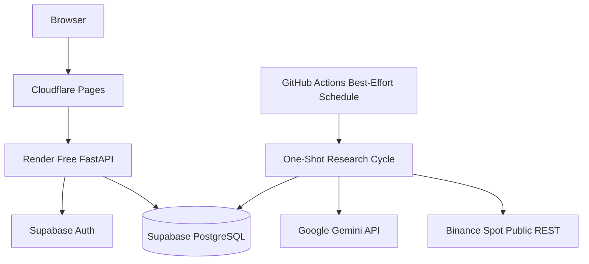

# Free Cloud Architecture

Last reviewed: 2026-08-01  
Status: Authoritative deployment profile for `M028` and `M029`

## 1. Objective

Run the verified research MVP in the cloud without depending on the owner’s local computer and without a required monthly infrastructure payment for the first controlled experiment.

This profile is reached only after:

- M001–M025 implementation work;
- M026 integrated local/CI verification;
- M027 export, restore, recovery, and security gate.

Cloud provisioning is not the repository entry point. Local Supabase and normal CI require no cloud project.

Free tiers are best effort and may pause, throttle, change quota, or become unavailable. This profile is experimental and does not provide an SLA.

## 2. Master-Task Scope

### M028 — Free-Cloud Infrastructure and Deployment

- create dedicated Supabase project;
- apply controlled migrations, Auth, and RLS;
- configure GitHub Actions one-shot scheduling;
- deploy FastAPI to Render Free;
- deploy React/Vite to Cloudflare Pages;
- configure domains, HTTPS, CORS, CSP, Auth redirects, secrets, and environment isolation;
- verify cold-start, schedule, Auth/RLS, and secret behavior.

### M029 — Controlled Paper Experiment

- implement free-profile operational visibility;
- repeat export/restore evidence;
- freeze exact experiment configuration;
- pass preflight;
- obtain owner approval;
- run, monitor, pause/halt, close, export, and report the 30-day paper experiment.

## 3. Selected Services

| Capability | Service | Role |
|---|---|---|
| Static frontend | Cloudflare Pages Free | React/Vite application |
| HTTP API | Render Free Web Service | Authenticated reads and explicit commands |
| Database and Auth | Dedicated Supabase Free project | Authoritative PostgreSQL and identity |
| Scheduled cycle | GitHub Actions | Best-effort one-shot execution |
| AI analysis | Google Gemini API bounded allowance | Structured advisory analysis |
| Market data | Binance Spot public REST | Finalized candles and symbol metadata |
| Source and CI | GitHub | Repository, checks, workflow, and artifacts |

The existing Eventnexus Supabase project must not be reused.

## 4. Deliberate Simplifications

The active free-cloud profile does not require:

- Redis;
- ARQ;
- a persistent worker;
- an always-on scheduler process;
- persistent Binance WebSocket ingestion;
- hosted Prometheus or Grafana;
- Kubernetes;
- private Binance credentials;
- Binance test orders;
- live trading.

These remain deferred. Activation requires measured need, M034 change governance, an accepted ADR, migration and rollback plans, security/privacy review, cost/capacity evidence, tests, staged paper verification, and owner approval. Exchange credential work additionally requires a separate future milestone.

## 5. Runtime Topology



Render availability does not determine scheduled-cycle execution.

## 6. One-Shot Research Cycle

Each logical occurrence:

1. loads the exact frozen experiment configuration;
2. acquires a PostgreSQL advisory lock or durable lease;
3. records intended and actual start time;
4. fetches Binance server time and actual eligible finalized candles;
5. validates and repairs approved gaps;
6. creates an immutable snapshot;
7. calculates versioned features;
8. checks Gemini request/token/cost budget;
9. optionally calls Gemini and validates the structured report;
10. applies deterministic fallback or HOLD when required;
11. evaluates deterministic strategy and risk;
12. simulates any approved paper action;
13. atomically posts order, fill, ledger, projection, audit, and outbox effects;
14. reconciles the portfolio;
15. persists complete cycle-stage status;
16. releases or safely expires the lock.

The command exits non-zero on integrity failure. Retry, delayed delivery, and duplicate dispatch never duplicate a financial side effect.

## 7. Scheduling Semantics

GitHub Actions runs approximately hourly using a non-zero minute offset.

Rules:

- schedule is best effort, not exact-time;
- workflow concurrency is configured;
- database lock/lease is the final overlap guard;
- job timeout is bounded;
- intended and actual timestamps remain separate;
- delayed cycles use actual eligible finalized data;
- missed cycles are recorded;
- missed/delayed cycles never create imagined historical trades;
- normal pull-request CI never accesses cloud experiment secrets or paid providers.

## 8. Render Boundary

Render hosts FastAPI for authenticated reads and explicit commands.

Expected free-tier behavior:

- idle spin-down;
- cold start;
- restarts;
- ephemeral local storage;
- possible provider-plan changes.

Therefore:

- no authoritative state is stored on local disk;
- the API does not start a duplicate scheduler or worker;
- cold-start state is visible in the UI;
- long backtests use controlled asynchronous jobs/workflows, not long synchronous requests;
- liveness and readiness are distinct;
- scheduled research continues while Render is asleep.

## 9. Supabase Boundary

Supabase provides PostgreSQL and Auth.

Requirements:

- dedicated project and environment-specific credentials;
- region chosen deliberately;
- all schema changes committed as immutable migrations;
- one expected migration head;
- RLS enabled on every Data API-visible table/view;
- deny-by-default browser access;
- approved read-only views only;
- critical financial/control tables server/workflow-only;
- service-role and database credentials remain server-side;
- no secret in source, workflow output, frontend, logs, prompts, or artifacts;
- export and restore procedures compensate for free-tier backup limitations.

## 10. Browser Data Policy

Direct browser reads may be allowed only through approved RLS-protected views or APIs.

Examples:

- portfolio summary;
- latest validated analysis;
- experiment/cycle status;
- backtest summary;
- public/demo-safe delayed evidence.

All state-changing financial, experiment, governance, release, incident, or access commands go through FastAPI application services. Direct browser writes to critical tables are prohibited.

## 11. GitHub Actions Security

- workflow permissions use least privilege;
- third-party actions are pinned;
- secrets/variables are environment-separated;
- logs redact credentials, tokens, connection strings, prompts, and unrestricted provider content;
- no untrusted fork receives protected secrets;
- failure persists a safe cycle/audit result;
- concurrency and timeout are explicit;
- schedule evidence includes run/attempt IDs when available;
- workflows cannot approve releases, strategies, or behavior changes automatically.

## 12. Cloudflare Pages Boundary

Only public client values are exposed, for example:

```env
VITE_API_BASE_URL=
VITE_SUPABASE_URL=
VITE_SUPABASE_PUBLISHABLE_KEY=
```

Requirements:

- production build is generated from the verified source revision;
- no service-role, database, Gemini, signing, or future exchange secret enters the build;
- React Router fallback works;
- HTTPS, CSP, CORS, Auth redirects, environment labels, and source-map policy are tested;
- public-demo and authenticated shells are separated;
- simulation, freshness, halt, reconciliation, and cold-start state remain visible.

## 13. Failure and Safe Degradation

| Condition | Required behavior |
|---|---|
| Render cold/sleeping | UI shows startup; cycle remains independent |
| GitHub schedule delayed | record delay; use actual eligible data |
| workflow overlap | one lock owner; others exit safely |
| Supabase unavailable | fail closed; no side effect |
| Supabase paused | incident/status state; recovery/runbook |
| Binance unavailable/stale | block entry; no fabricated data |
| Gemini unavailable/quota exhausted | deterministic fallback or HOLD |
| invalid/unsafe Gemini output | reject and preserve validation evidence |
| risk rejection/halt | no unauthorized order |
| ledger/reconciliation mismatch | halt and preserve critical evidence |
| free quota lost/changed | degrade safely; no auto-upgrade |
| export/restore failure | block experiment start/continuation according to policy |

## 14. Observability for the Free Profile

Use:

- structured FastAPI and CLI logs;
- GitHub Actions run history and safe artifacts;
- Render and Supabase operational logs;
- persistent research-cycle records;
- audit, data-quality, halt, incident, and reconciliation records;
- frontend status views.

Required UI state:

- environment and simulation;
- current experiment lifecycle;
- latest attempted and successful cycle;
- next expected cycle as an estimate;
- latest finalized candle/freshness;
- Gemini/fallback/budget state;
- risk halt;
- reconciliation/integrity;
- dependency and cold-start state;
- active incident or blocker.

Hosted Prometheus/Grafana remains deferred and must not be represented as completed.

## 15. Export, Backup, and Restore

M027 proves local export/restore before cloud deployment.

Before M029 start and at approved cadence:

- create a logical export;
- store it in an approved protected location;
- record source revision, migration head, time, hash, and scope;
- restore into an isolated local or separate project;
- verify migration state;
- rebuild projections;
- reconcile the ledger;
- record limitations and provider retention constraints.

A free-provider backup claim is not accepted without tested restore evidence.

## 16. Cost and Quota Guardrails

- required infrastructure spend target: EUR 0 during the initial experiment;
- Gemini monthly cost budget defaults to EUR 0;
- paid use requires explicit versioned configuration and owner approval;
- current quotas/limits come from approved provider evidence, not frozen prose;
- exhausted or unknown quota degrades safely;
- no automatic plan upgrade, resource purchase, scaling, or budget increase;
- M030 measures actual costs, quotas, capacity, and architecture triggers after operation.

## 17. M028 Acceptance Gate

M028 is verified when:

- M001–M027 prerequisites are verified;
- dedicated Supabase exists and is isolated;
- controlled migrations/Auth/RLS pass;
- scheduled/manual one-shot workflow works;
- Render and Cloudflare public HTTPS endpoints work;
- Auth, CORS, CSP, routing, cold-start, idempotency, and secret tests pass;
- local computer is unnecessary for scheduled cycles;
- export/restore remains valid;
- deployment revision and limitations are recorded;
- live/private exchange capabilities are absent.

## 18. M029 Acceptance Gate

M029 is verified when:

- cloud operational visibility and runbooks exist;
- export/restore evidence is current;
- exact experiment configuration and behavior-set hashes are frozen;
- preflight passes;
- owner approves start;
- first and subsequent cycles are auditable;
- incidents, halts, quotas, data freshness, AI, risk, ledger, and reconciliation are monitored;
- duplicate financial side effects remain zero;
- the experiment reaches an auditable terminal state;
- final export/report and owner closure decision exist;
- profit is not used as completion proof.

## 19. Promotion Beyond the Experiment

M029 does not directly promote to production research.

Required sequence:

- M030 performance/FinOps;
- M031 data governance;
- M032 research review;
- M033 incident learning;
- M034 change governance;
- M035 post-experiment decision and staging;
- M036 production research.

## 20. Related Documents

- `/TASKS.md`
- `IMPLEMENTATION_EXECUTION_PLAN.md`
- `TASK_CATALOG_INDEX.md`
- `ARCHITECTURE.md`
- `DEPLOYMENT.md`
- `LOCAL_DEVELOPMENT.md`
- `TEST_ENVIRONMENTS.md`
- `SECURITY.md`
- `DATABASE_SCHEMA.md`
- `OBSERVABILITY.md`
- `/CLOUD_MVP_TASKS.md`
