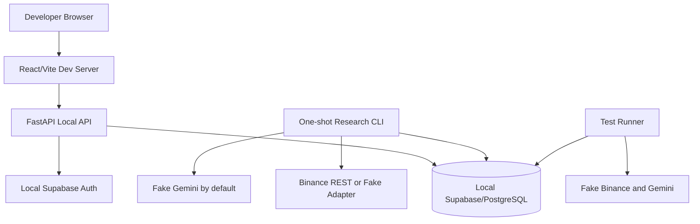

# Local Development

Last reviewed: 2026-07-31
Status: Authoritative local-development specification

## 1. Purpose

The local environment must allow a developer or AI coding agent to build, test, debug, and validate the complete application without depending on paid services, production credentials, or a continuously available cloud environment.

Local development is not the formal 30-day experiment environment. It is an isolated engineering environment using fake providers by default.

## 2. Required Tooling

- Git
- Python 3.12
- the repository-selected Python package manager and committed lock file
- Node.js LTS and the committed frontend lock file
- Docker Engine with Docker Compose v2
- Supabase CLI
- PostgreSQL client tools where useful
- Make, Task, or equivalent repository command runner selected during implementation

Tool versions must be pinned or documented. The repository must provide commands that work on Windows 11, Linux, and macOS where practical. Platform-specific exceptions must be documented.

## 3. Local Architecture



The default local profile must not require Redis, ARQ, a persistent WebSocket worker, a real Gemini key, or a private Binance key.

## 4. Repository Layout

Expected implementation layout:

```text
backend/
frontend/
ai/
supabase/
├── config.toml
├── migrations/
├── seed.sql
└── tests/
infrastructure/
├── render/
├── cloudflare/
└── github-actions/
tests/
```

Generated artifacts must have stable paths and documented regeneration commands.

## 5. Environment Files

Use layered environment files:

- `.env.example` — committed safe reference
- `.env.local` — ignored developer values
- `.env.test` — safe deterministic test configuration
- `.env.cloud.example` — optional committed cloud variable inventory without secrets

Rules:

- no real secret is committed;
- local Supabase keys generated by the CLI may be stored only in ignored files;
- production-like credentials must never be reused locally;
- fake providers are the default;
- `LIVE_TRADING_ENABLED=false` is mandatory in every local profile.

## 6. Startup Profiles

### 6.1 Minimal Backend Profile

Starts:

- local Supabase/PostgreSQL;
- FastAPI;
- fake Binance adapter;
- fake Gemini provider.

Purpose: API and domain development.

### 6.2 Full Local UI Profile

Starts:

- local Supabase stack;
- FastAPI;
- React/Vite frontend;
- fake providers;
- seeded owner account and sample research data.

Purpose: end-to-end feature development.

### 6.3 Public Provider Development Profile

Uses:

- local database;
- Binance public REST;
- optional real Gemini development key;
- explicit low request and token budgets.

This profile is opt-in and must never run in normal CI.

### 6.4 Failure Injection Profile

Allows deterministic simulation of:

- Gemini timeout, 429, safety block, refusal, invalid schema, and empty response;
- Binance timeout, malformed candle, rate limit, gap, and stale data;
- database transaction failure;
- duplicate command;
- reconciliation mismatch.

## 7. Required Commands

The implementation must expose stable commands equivalent to:

```text
bootstrap           install dependencies and verify tools
local-up            start local Supabase and application dependencies
local-down          stop local services
local-reset         recreate database and apply migrations and seed data
api-dev              run FastAPI with reload
frontend-dev         run Vite development server
research-cycle      run one deterministic research cycle
format              format supported languages
lint                run lint checks
check-types         run static type checks
unit-test           run unit tests
integration-test    run integration tests
contract-test       run provider contract tests using fakes or fixtures
e2e-test            run critical end-to-end flows
security-test       run static, dependency, secret, and container checks
all-checks          run the local pre-push quality gate
```

Exact command syntax may use `make`, `task`, package scripts, or repository scripts, but names and documentation must remain stable after adoption.

## 8. Database Workflow

1. Start the local Supabase stack.
2. Apply all migrations from a clean database.
3. Seed only deterministic non-sensitive fixtures.
4. Run database tests.
5. Verify migration drift.
6. Reset and repeat in CI.

Developers must not make persistent schema changes through the dashboard without generating a committed migration.

Applied migration files are immutable. Corrections require new migrations.

## 9. Seed Data

Local seed data may include:

- one owner user;
- one viewer user;
- a sample workspace;
- BTC/EUR symbol metadata fixtures;
- finalized candle fixtures;
- one virtual EUR 20 portfolio;
- fake Gemini reports;
- strategy and risk-policy versions.

Seed data must be clearly synthetic and safe to commit.

## 10. Local Authentication

Use local Supabase Auth or a deterministic test authentication adapter according to the test layer.

- browser E2E tests use local Auth;
- unit tests use project-owned fake identities;
- authorization logic remains server-side;
- service-role credentials never enter frontend code;
- local users must not share production identifiers.

## 11. Local Research Cycle

The one-shot CLI must support:

```text
python -m app.cli.run_research_cycle --symbol BTC/EUR --interval 1h --as-of <timestamp>
```

The command must:

- acquire a database lease;
- ingest missing finalized candles;
- validate freshness and quality;
- build an immutable snapshot;
- calculate features;
- invoke fake or configured Gemini;
- run strategy and risk;
- simulate paper execution;
- reconcile the ledger;
- emit a structured summary;
- return a meaningful exit code.

Repeated execution for the same logical cycle must be idempotent.

## 12. Debugging

- correlation IDs must be visible in local logs;
- pretty logs may be enabled locally only;
- SQL logging is disabled by default and must redact parameters where sensitive;
- raw Gemini prompts and responses are not logged by default;
- fixtures should permit deterministic reproduction of failures;
- developers should be able to trace one decision from candle to ledger using IDs.

## 13. Local Test Data Isolation

Each test suite must use an isolated schema, database, transaction strategy, or ephemeral Supabase instance.

Tests must not:

- use a developer's normal local data;
- depend on execution order;
- depend on current market prices;
- depend on a live Gemini response;
- leave persistent financial state after completion.

## 14. Windows Development

The project must account for Windows 11 development:

- commands must avoid shell-only assumptions where practical;
- paths use cross-platform libraries;
- line endings are controlled by repository configuration;
- Docker Desktop and WSL2 setup notes are documented;
- PowerShell examples are provided for environment setup where needed;
- scripts fail with actionable messages when required tools are missing.

## 15. Local Definition of Ready

A task is ready for local implementation when:

- dependencies are documented;
- required fixtures exist or are part of the task;
- expected migration impact is known;
- provider behavior can be faked;
- acceptance criteria are objectively testable.

## 16. Local Definition of Done

A locally implemented task is not complete until:

- the feature runs from a clean checkout;
- migrations apply from zero;
- relevant unit, integration, contract, and E2E tests pass;
- format, lint, type, and security checks pass;
- no secret is required for the normal test path;
- documentation and `.env.example` are synchronized;
- Windows-specific behavior is checked when the change affects commands or paths.

## 17. Related Documents

- `/AGENTS.md`
- `TESTING.md`
- `DEPLOYMENT.md`
- `FREE_CLOUD_ARCHITECTURE.md`
- `SECURITY.md`
- `BACKEND.md`
- `/LOCAL_AND_PRODUCTION_TASKS.md`
