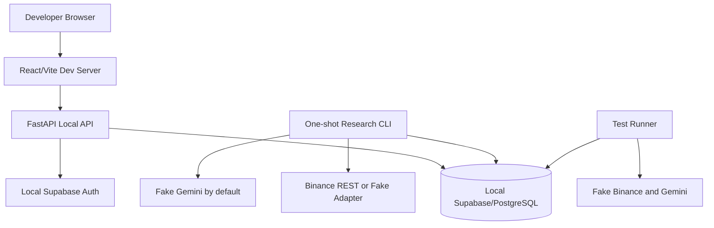

# Local Development

Last reviewed: 2026-08-01  
Status: Authoritative local-development specification mapped to `M001–M006`, `M026`, and `M027`

## 1. Purpose

The local environment must allow a developer or AI coding agent to build, test, debug, and validate the complete application without depending on paid services, production credentials, a cloud project, or a continuously available cloud environment.

Local development is not the formal 30-day experiment environment. It is an isolated engineering environment using fake providers by default.

Implementation starts with `M001` in `/TASKS.md`. This document defines local behavior and acceptance criteria but does not create an alternative task order.

## 2. Required Tooling

- Git;
- Python 3.12.12, selected by `/.python-version`;
- the repository-selected Python package manager and committed lock file;
- Node.js 22.17.1, selected by `/.nvmrc`, and npm 10.9.2;
- Docker Engine with Docker Compose v2 where required by Supabase CLI;
- Supabase CLI;
- PostgreSQL client tools where useful;
- the repository command runner selected in `M001`.

Tool versions must be pinned or documented. Repository commands must work on Windows 11 and at least one Unix-like environment. Platform-specific exceptions must be explicit and tested where practical.

`backend/requirements.txt` is the shared Python 3.12 lock. Its direct `colorama==0.4.6 ; sys_platform == "win32"` entry makes the Windows-only tooling dependency deterministic without installing it on Linux. The `lock` command normalizes that marker after `pip-compile`, and `lock-check` detects drift without retaining a generated local change. Frontend installation uses only `npm ci` and the committed lock.

## 3. Local Architecture



The default local profile must not require:

- a cloud Supabase project;
- Redis or ARQ;
- a persistent worker;
- Binance WebSocket ingestion;
- hosted Prometheus or Grafana;
- a real Gemini key;
- a private Binance key;
- Binance test trading;
- live trading.

## 4. Repository Layout

Expected implementation layout:

```text
backend/
frontend/
ai/
supabase/
├── config.toml
├── migrations/
├── seed.sql
└── tests/
infrastructure/
├── render/
├── cloudflare/
└── github-actions/
tests/
docs/
```

Generated artifacts must have stable paths, source revisions, hashes, and documented regeneration commands.

## 5. Environment Files

Use layered environment files:

- `.env.example` — committed safe reference;
- `.env.local` — ignored developer values;
- `.env.test` — safe deterministic test configuration;
- `.env.cloud.example` — optional committed cloud variable inventory without secrets.

Rules:

- no real secret is committed;
- local Supabase values generated by the CLI remain in ignored files;
- production-like credentials are never reused locally;
- fake providers are the default;
- `LIVE_TRADING_ENABLED=false` is mandatory in every local profile;
- `PRIVATE_BINANCE_API_ENABLED=false`, `REDIS_ENABLED=false`, `ARQ_ENABLED=false`, and `WEBSOCKET_INGESTION_ENABLED=false` remain safe defaults;
- public frontend variables are explicitly allowlisted.

## 6. Startup Profiles

### 6.1 Minimal Backend Profile

Starts:

- local Supabase/PostgreSQL;
- FastAPI;
- fake Binance adapter;
- fake Gemini provider.

Purpose: API and domain development.

### 6.2 Full Local UI Profile

Starts:

- local Supabase stack;
- FastAPI;
- React/Vite frontend;
- fake providers;
- seeded owner/operator/viewer identities and sample research data.

Purpose: end-to-end feature development.

### 6.3 Public Provider Development Profile

Uses:

- local database;
- Binance public REST;
- optional real Gemini development key;
- explicit low request, token, and cost budgets.

This profile is opt-in, separated from normal development, and never runs in ordinary CI.

### 6.4 Failure Injection Profile

Supports deterministic simulation of:

- Gemini authentication failure, timeout, cancellation, 429, 5xx, safety block, refusal, malformed output, invalid schema, unsupported claim, injection, stale source, empty response, and budget exhaustion;
- Binance timeout, malformed candle, rate limit, gap, stale data, provider clock skew, and unavailable metadata;
- database transaction failure, lock conflict, deadlock, or outage;
- duplicate command or cycle;
- partial processing and restart;
- reconciliation mismatch;
- export, restore, and recovery failure.

## 7. Required Commands

The implementation must expose stable commands equivalent to:

```text
bootstrap           install dependencies and verify tools
local-up            start local Supabase and application dependencies
local-down          stop local services
local-reset         recreate database, migrations, and seed data
api-dev             run FastAPI with reload
frontend-dev        run Vite development server
research-cycle      run one deterministic research cycle
format              format supported languages
lint                run lint checks
check-types         run static type checks
unit-test           run unit and property tests
integration-test    run database, Auth, RLS, and integration tests
contract-test       run provider and API contract tests
e2e-test            run critical end-to-end flows
security-test       run backend static and locked dependency checks
frontend-audit      fail on moderate-or-higher frontend dependency findings
docs-check          run documentation and generated-artifact checks
export-test         create a test logical export
restore-test        restore and reconcile in isolation
all-checks          run the local pre-push quality gate
quality             run the deterministic baseline quality gate
```

Exact syntax may use `make`, `task`, package scripts, or repository scripts, but adopted command names and behavior must remain stable or be migrated through documentation and CI together.

## 8. Database Workflow

1. Start the local Supabase stack.
2. Apply all committed migrations from an empty database.
3. Verify one expected migration head.
4. Seed only deterministic non-sensitive fixtures.
5. Run database, Auth, RLS, constraint, transaction, and lease tests.
6. Verify migration drift.
7. Reset and repeat in CI.

Developers must not make persistent schema changes through a dashboard without generating a committed migration.

Applied migration files are immutable. Corrections require new migrations.

## 9. Seed Data

Local seed data may include:

- synthetic owner, operator, and viewer users;
- a sample workspace;
- BTC/EUR symbol metadata fixtures;
- finalized candle fixtures;
- one virtual EUR 20 portfolio;
- fake Gemini reports and validation results;
- strategy, risk, execution, accounting, and configuration versions;
- sample cycle, order, fill, ledger, reconciliation, backtest, incident, and audit evidence as implementation progresses.

Seed data must be clearly synthetic, deterministic, versioned, safe to commit, and free of production identifiers.

## 10. Local Authentication and RLS

Use local Supabase Auth or a deterministic test identity adapter according to the test layer.

- browser E2E tests use local Auth;
- unit tests use project-owned fake identities;
- authorization remains enforced server-side;
- RLS is tested as a second deny-by-default boundary;
- service-role and migration credentials never enter frontend code;
- local users do not share cloud or production identifiers;
- browser identities cannot write critical financial, AI, audit, experiment, governance, or release tables directly.

## 11. Local Research Cycle

The one-shot CLI must support a stable repository command and a Python entry point equivalent to:

```text
python -m app.cli.run_research_cycle --experiment-id <uuid> --occurrence <timestamp>
```

A complete cycle must:

- load the exact frozen configuration;
- acquire a database advisory lock or durable lease;
- load actual eligible finalized candles;
- repair approved gaps;
- validate freshness and quality;
- build an immutable snapshot;
- calculate versioned features;
- check budget and invoke fake or configured Gemini when allowed;
- validate AI output or activate deterministic fallback;
- run strategy and risk;
- simulate approved paper execution;
- atomically post order, fill, ledger, audit, and projection effects;
- reconcile;
- persist complete cycle-stage evidence;
- emit a safe structured summary;
- return a meaningful exit code;
- release or safely expire the lock.

Repeated execution for the same logical occurrence must return existing results or a deterministic conflict without duplicating financial effects.

## 12. Debugging

- correlation, request, cycle, experiment, entity, and trace-safe identifiers are visible in local logs;
- pretty logs may be enabled locally only;
- SQL logging is disabled by default and redacts values when enabled;
- raw Gemini prompts and unrestricted responses are not logged by default;
- fixtures permit deterministic reproduction of failures;
- developers can trace one result from candle through snapshot, features, AI, strategy, risk, order, fill, ledger, reconciliation, and audit;
- secrets and authorization data never appear in diagnostic exports.

## 13. Local Test Isolation

Each test suite uses an isolated schema, database, transaction strategy, or ephemeral Supabase instance.

Tests must not:

- use a developer’s normal local data;
- depend on execution order;
- depend on current market prices;
- depend on a live Gemini response;
- use cloud/production credentials;
- leave persistent financial or control state after completion;
- pass only through blind retries.

Time, randomness, IDs, provider behavior, and schedules must be injected or seeded.

## 14. Windows Development

The project must account for Windows 11:

- commands avoid shell-specific assumptions where practical;
- paths use cross-platform libraries;
- line endings are controlled by repository configuration;
- Docker Desktop, WSL2, and Supabase CLI setup notes are documented where applicable;
- PowerShell examples are provided for environment setup;
- scripts fail with actionable messages when prerequisites are missing;
- the shared Python lock pins Windows-only dependencies with explicit platform markers;
- path quoting, executable discovery, and environment-file behavior are tested.

## 15. Master-Task Mapping

- `M001` — repository scaffold and commands;
- `M002` — locked toolchains and baseline CI;
- `M003` — local Supabase, migrations, Auth, and RLS;
- `M004` — frontend foundation and design tokens;
- `M005` — settings, logging, errors, transactions, and idempotency;
- `M006` — provider contracts and deterministic fakes;
- `M026` — integrated deterministic local demo and full CI verification;
- `M027` — export, restore, recovery, and security release gate.

Other domain Master Tasks are developed and verified using this local foundation.

## 16. Local Definition of Ready

A detailed card is ready for local implementation only when:

- its mapped Master Task is selected;
- all hard dependencies in `TASKS.md` are `VERIFIED`;
- required fixtures exist or are included in scope;
- expected migration and compatibility impact is known;
- provider behavior can be faked;
- failure cases and invariants are defined;
- acceptance criteria are objectively testable;
- required source and generated-artifact ownership is known.

## 17. Local Definition of Verified

A locally implemented Master Task is not complete until:

- the feature runs from a clean checkout;
- migrations apply from zero and drift checks pass;
- relevant unit, property, integration, contract, API, component, accessibility, visual, E2E, security, documentation, export, restore, or recovery checks pass;
- format, lint, type, and build checks pass;
- no paid credential is required for the normal test path;
- no secret or production data is present;
- documentation, task evidence, environment examples, and generated artifacts are synchronized;
- Windows-specific behavior is checked when commands or paths are affected;
- the final commit or pull request is fetched and inspected;
- the Master Task status and evidence are updated.

Only `VERIFIED` is complete.

## 18. Related Documents

- `/AGENTS.md`
- `/TASKS.md`
- `IMPLEMENTATION_EXECUTION_PLAN.md`
- `TESTING.md`
- `TEST_ENVIRONMENTS.md`
- `DEPLOYMENT.md`
- `FREE_CLOUD_ARCHITECTURE.md`
- `SECURITY.md`
- `BACKEND.md`
- `/LOCAL_AND_PRODUCTION_TASKS.md`
