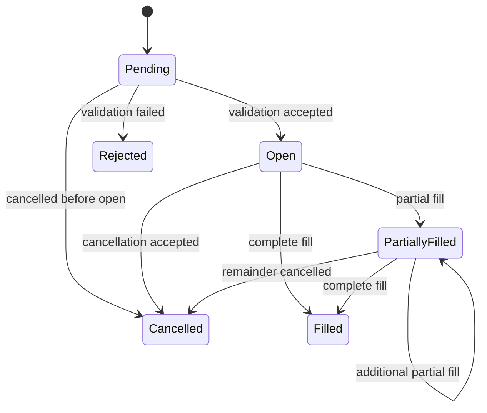

# Paper Trading

Last reviewed: 2026-07-31
Status: Authoritative MVP simulated-execution specification

## 1. Purpose

The paper-trading engine simulates order lifecycle, fills, fees, slippage, and portfolio effects without using private exchange credentials or real capital.

It is designed for conservative research, not for pretending that simulation exactly matches real execution.

## 2. Scope

Supported in MVP:

- long-only spot exposure;
- market buy and sell;
- limit buy and sell;
- cancellation;
- partial fills;
- time-in-force values explicitly supported by the simulation model;
- fee, spread, slippage, precision, minimum-notional, and volume assumptions;
- deterministic replay for backtesting.

Not supported:

- leverage;
- margin;
- futures;
- shorting;
- stop orders unless added in a later approved version;
- exchange-native queue priority;
- real market impact;
- hidden liquidity;
- private Binance order placement.

## 3. Order Creation Preconditions

A paper order may be created only when:

- experiment and portfolio are in an allowed state;
- no applicable halt is active;
- strategy intent is immutable and valid;
- risk evaluation outcome is APPROVE or APPROVE_REDUCED;
- approved quantity/notional is positive;
- symbol metadata and precision are current;
- execution-model version exists;
- idempotency key is valid;
- no paper order already exists for the approved risk evaluation.

Clients cannot bypass risk by submitting arbitrary quantity or notional.

## 4. Order Model

Required fields:

- portfolio;
- approved risk evaluation;
- idempotency/client order ID;
- symbol;
- side;
- order type;
- requested and approved quantity/notional;
- optional limit price;
- time in force;
- execution-model version;
- state;
- created and updated timestamps;
- cancellation metadata;
- lineage references.

## 5. Order States

Terminal states are `Rejected`, `Filled`, and `Cancelled`. Terminal state transitions are immutable.

## 6. Execution Model Version

Every order references an immutable execution-model version containing:

- reference-price rule;
- spread model;
- slippage model;
- fee schedule;
- volume/participation assumption;
- partial-fill rule;
- intrabar ordering rule;
- precision and rounding rule;
- minimum-notional behavior;
- time-in-force behavior;
- deterministic random seed policy if any stochastic simulation is introduced.

No active experiment may silently change execution assumptions.

## 7. Market Order Fill Model

Baseline design:

- a market order becomes eligible at the next allowed simulation event after approval;
- reference price is the next eligible finalized candle open or another explicitly versioned event price;
- spread and adverse slippage are added conservatively for buys and subtracted for sells;
- quantity is rounded down to valid step size;
- fee reserve is considered before approval and posted on fill;
- insufficient data or missing execution assumptions reject the fill rather than guessing.

A same-candle fill using information unavailable at decision time is prohibited.

## 8. Limit Order Fill Model

A buy limit may fill only when the eligible candle low reaches or crosses the limit. A sell limit may fill only when the candle high reaches or crosses the limit.

Rules:

- touching the limit does not imply guaranteed full fill unless the model explicitly says so;
- partial fills may depend on configured participation and available volume assumptions;
- fill price cannot be more favorable than the limit unless the model explicitly simulates price improvement;
- ambiguous intrabar order of high and low resolves conservatively;
- an order cannot use a candle that was already complete before the order became active.

## 9. Spread and Slippage

Spread and slippage must be explicit, versioned, and included in every applicable fill.

Possible model inputs:

- fixed basis points;
- volatility-dependent component;
- order-size/volume participation component;
- bounded minimum and maximum;
- side-aware adverse adjustment.

Default assumptions must be conservative and documented. Calibration evidence should be added when real observations become available.

## 10. Fees

Fee model defines:

- rate;
- fee currency/asset;
- maker/taker distinction if simulated;
- rounding;
- minimum fee if any;
- whether fees reduce acquired asset or debit quote cash.

Fees are posted as explicit ledger entries. Reports must include total fees.

## 11. Precision and Filters

Before order creation and fill:

- apply quantity step size;
- apply price tick size;
- enforce minimum quantity;
- enforce minimum notional;
- validate maximum bounds where modeled;
- round conservatively with Decimal;
- reject when rounding produces zero or invalid value.

Persisted Binance metadata is the source for exchange-like constraints.

## 12. Partial Fills

Partial fills must:

- never exceed remaining approved quantity;
- preserve deterministic fill sequence;
- post ledger entries atomically per fill;
- update remaining quantity;
- allow cancellation of the remainder;
- include fee and slippage per fill;
- preserve all fill lineage.

## 13. Cancellation

Cancellation is idempotent.

- open or partially filled order: cancel remaining quantity;
- already cancelled: return existing terminal result;
- filled or rejected: return deterministic conflict or current terminal state according to API contract;
- cancellation never reverses completed fills.

## 14. Atomic Fill Processing

One transaction must atomically persist:

- fill;
- order state transition;
- ledger debit/credit entries;
- fee entries;
- portfolio projection update or invalidation marker;
- transactional outbox/audit event.

If the transaction fails, none of these effects are committed.

## 15. Idempotency

Required deterministic identities:

- one order per approved risk evaluation;
- unique portfolio/idempotency key;
- unique order/fill sequence;
- deterministic fill-event key from order and market event.

Duplicate job delivery must return prior state without duplicate fill or ledger posting.

## 16. Reconciliation

After each fill cycle:

- rebuild or verify balances from ledger;
- verify filled quantity against order;
- verify reserved cash/asset release;
- verify position projection;
- verify fees and P&L;
- record reconciliation result.

Mismatch creates a critical event and halt.

## 17. Halt Behavior

When halted:

- no new ENTER order may be created;
- open orders may be cancelled according to policy;
- EXIT or REDUCE may be allowed only through explicit safe policy;
- scheduled fill processing must respect halt semantics;
- state remains readable and auditable.

## 18. Limitations

Paper execution cannot accurately reproduce:

- real order-book queue priority;
- network and exchange latency;
- market impact;
- hidden or rapidly changing liquidity;
- exchange outages and matching-engine behavior;
- real spread at exact execution time when only candle data is used;
- fee-tier changes;
- emotional or manual behavior.

Every report must state these limitations.

## 19. Tests

Required tests:

- market buy and sell;
- limit crossing and non-crossing;
- next-event/no-look-ahead behavior;
- partial fills;
- cancellation and repeated cancellation;
- precision and minimum-notional boundaries;
- fee and slippage calculation;
- conservative intrabar ordering;
- duplicate job replay;
- restart between order and fill;
- transaction rollback;
- quantity never exceeds approval;
- atomic ledger posting;
- reconciliation mismatch and halt;
- unsupported order type rejection;
- no leverage or short output.

## 20. Metrics

- orders by type and state;
- fill and partial-fill counts;
- cancellations and rejections;
- fill delay;
- simulated fee and slippage;
- duplicate attempts;
- processing failures;
- reconciliation outcome;
- active open orders.

## 21. Related Documents

- `RISK_ENGINE.md`
- `PORTFOLIO_ENGINE.md`
- `BACKTEST_ENGINE.md`
- `DATABASE_SCHEMA.md`
- `API_SPECIFICATION.md`
- `TESTING.md`
- `OBSERVABILITY.md`
